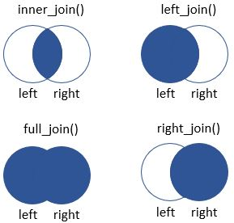

# Unir tablas

En esta lección se mostrarán las opciones que ofrece `tidyverse` para unir dos tablas. Si conocéis algo de lenguaje SQL es muy similar. Hay varias formas de unir dos tablas. Aquí se aprenderemos algunas de ellas. Todas pueden visualizarse en la siguiente imagen:



- **inner_join()**
- **left_join()** y **right_join()**
- **full_join()**

En este caso usaremos dos tablas diferentes, **results** y **gene_info**.

```{r}
library(tidyverse)
results <- read.delim("../../input_data/results_table.tsv")
gene_info <- read.delim("../../input_data/gene_info.tsv")
```

## **inner_join()**

La función **inner_join()** se usa cuando queremos unir dos tablas de forma que mantengamos la información que está en ambas, desechando la información que no se comparte. Veremos un ejemplo a continuación. Vamos a filtrar la tabla de **results** para quedarnos con los genes cuyo log
FoldChange sea mayor de 2 y la tabla **gene_info** para quedarnos con los genes que sean del cromosoma X. Cuando se haga el **inner_join()** mantendremos los genes que se mantienen en ambas tablas, es decir aquellos con log2FoldChange > 2 y pertenecientes al cromosoma X.

Para unir las tablas debemos establecer las columnas por las que queremos unirlas, en este caso se trata de la columna "gene" de la tabla **results** y la columna "ensembl_gene_id" de la tabla **gene_info**. Esta información se establece con el parámetro *by*. Si ambas tablas tuvieran una columna con el mismo nombre, lo detectaría automáticamente.

```{r}
results_filt <- results %>% filter(log2FoldChange > 2)
gene_info_filt <- gene_info %>% filter(chromosome_name == "X")

results_filt %>%
  inner_join(gene_info_filt,
             by = c("gene" = "ensembl_gene_id"))

# baseMean log2FoldChange    lfcSE     stat     pvalue      padj            gene hgnc_symbol chromosome_name
# 1 1.5400973       3.293303 1.529176 2.153646 0.03126793 0.9999792 ENSG00000102271       KLHL4               X
# 2 0.4380945       2.039263 1.856920 1.098197 0.27211865 0.9999792 ENSG00000229331      GK-IT1               X
# 3 0.7224753       2.982983 1.997325 1.493489 0.13530920 0.9999792 ENSG00000230916    MTCO1P53               X
```

## **left_join()** y **right_join()**

Al contrario que con **inner_join()**, estas dos funciones se usarán cuando queremos mantener todos los datos de una tabla aunque no estén presentes en la otra. La diferencia es que **left_join()** hace referencia a la tabla que llega por la izquierda, es decir, la primera tabla, mientras **right_join()** hace referencia a la tabla de la derecha, la segunda. Lo veremos más fácilmente con dos ejemplos. En este caso queremos usar la tabla de **results_filt** generada anteriormente pero queremos unirle la tabla completa de **gene_info**. Para ello usaremos la función **right_join()**. Lo que ocurre es que nos genera una tabla con todos los genes de **gene_info** (tabla de la derecha) añadiendo NAs a las columnas de **results_filt** de las que no se dispone información.

```{r}
results_filt %>%
  right_join(gene_info,by = c("gene" = "ensembl_gene_id")) %>%
  as_tibble()

# # A tibble: 38,871 x 9
# baseMean log2FoldChange lfcSE  stat pvalue  padj gene            hgnc_symbol chromosome_name
# <dbl>          <dbl> <dbl> <dbl>  <dbl> <dbl> <chr>           <chr>       <chr>          
#   1    1.08            2.12  1.12 1.90  0.0577  1.00 ENSG00000006659 LGALS14     19             
# 2    0.515           2.29  1.24 1.85  0.0643  1.00 ENSG00000007866 TEAD3       6              
# 3    0.625           2.16  1.21 1.79  0.0741  1.00 ENSG00000021488 SLC7A9      19             
# 4    6.19            2.33  1.08 2.16  0.0306  1.00 ENSG00000064300 NGFR        17             
# 5    1.37            3.13  1.23 2.54  0.0111  1.00 ENSG00000100191 SLC5A4      22             
# 6    1.54            3.29  1.53 2.15  0.0313  1.00 ENSG00000102271 KLHL4       X              
# 7    0.586           2.48  1.73 1.43  0.152   1.00 ENSG00000104055 TGM5        15             
# 8    0.373           2.01  2.18 0.920 0.357   1.00 ENSG00000104723 TUSC3       8              
# 9    2.35            2.45  1.45 1.69  0.0918  1.00 ENSG00000105131 EPHX3       19             
# 10    0.445           2.34  1.99 1.18  0.239   1.00 ENSG00000106006 HOXA6       7              
# # ... with 38,861 more rows
```

Como se puede apreciar, el resultado genera una tabla de más de 38.000 filas, cuando la tabla de **results_filt** solo tenía 125.

La función **left_join()** funciona exactamente igual pero en priorizando la primera tabla en vez de la segunda.

```{r}
gene_info %>%
  left_join(results_filt,by = c("ensembl_gene_id" = "gene")) %>%
  as_tibble()

# # A tibble: 38,871 x 9
# ensembl_gene_id hgnc_symbol chromosome_name baseMean log2FoldChange lfcSE  stat pvalue  padj
# <chr>           <chr>       <chr>              <dbl>          <dbl> <dbl> <dbl>  <dbl> <dbl>
#   1 ENSG00000000003 TSPAN6      X                     NA             NA    NA    NA     NA    NA
# 2 ENSG00000000419 DPM1        20                    NA             NA    NA    NA     NA    NA
# 3 ENSG00000000457 SCYL3       1                     NA             NA    NA    NA     NA    NA
# 4 ENSG00000000460 C1orf112    1                     NA             NA    NA    NA     NA    NA
# 5 ENSG00000000938 FGR         1                     NA             NA    NA    NA     NA    NA
# 6 ENSG00000000971 CFH         1                     NA             NA    NA    NA     NA    NA
# 7 ENSG00000001036 FUCA2       6                     NA             NA    NA    NA     NA    NA
# 8 ENSG00000001084 GCLC        6                     NA             NA    NA    NA     NA    NA
# 9 ENSG00000001167 NFYA        6                     NA             NA    NA    NA     NA    NA
# 10 ENSG00000001460 STPG1       1                     NA             NA    NA    NA     NA    NA
# # ... with 38,861 more rows
```

El reusltado es exactamente el mismo.

## **full_join()**

La última función que veremos es **full_join()**. Esta función se encarga de unir ambas tablas sin tener en cuenta las filas que comparten. Tanto por izquierda como por derecha introducirá NAs en las filas que no compartan un mismo valor. Lo veremos cuando nos fijemos en la parte delantera y trasera de la tabla final.

```{r}
results_filt %>%
  full_join(gene_info_filt, by = c("gene" = "ensembl_gene_id")) %>%
  as_tibble()

# # A tibble: 1,434 x 9
# baseMean log2FoldChange lfcSE  stat pvalue  padj gene            hgnc_symbol chromosome_name
# <dbl>          <dbl> <dbl> <dbl>  <dbl> <dbl> <chr>           <chr>       <chr>          
#   1    1.08            2.12  1.12 1.90  0.0577  1.00 ENSG00000006659 NA          NA             
# 2    0.515           2.29  1.24 1.85  0.0643  1.00 ENSG00000007866 NA          NA             
# 3    0.625           2.16  1.21 1.79  0.0741  1.00 ENSG00000021488 NA          NA             
# 4    6.19            2.33  1.08 2.16  0.0306  1.00 ENSG00000064300 NA          NA             
# 5    1.37            3.13  1.23 2.54  0.0111  1.00 ENSG00000100191 NA          NA             
# 6    1.54            3.29  1.53 2.15  0.0313  1.00 ENSG00000102271 KLHL4       X              
# 7    0.586           2.48  1.73 1.43  0.152   1.00 ENSG00000104055 NA          NA             
# 8    0.373           2.01  2.18 0.920 0.357   1.00 ENSG00000104723 NA          NA             
# 9    2.35            2.45  1.45 1.69  0.0918  1.00 ENSG00000105131 NA          NA             
# 10    0.445           2.34  1.99 1.18  0.239   1.00 ENSG00000106006 NA          NA             
# # ... with 1,424 more rows

results_filt %>%
  full_join(gene_info_filt, by = c("gene" = "ensembl_gene_id")) %>%
  slice_tail(n = 10) %>%
  as_tibble()

# # A tibble: 10 x 9
# baseMean log2FoldChange lfcSE  stat pvalue  padj gene            hgnc_symbol chromosome_name
# <dbl>          <dbl> <dbl> <dbl>  <dbl> <dbl> <chr>           <chr>       <chr>          
#   1       NA             NA    NA    NA     NA    NA ENSG00000283400 ""          X              
# 2       NA             NA    NA    NA     NA    NA ENSG00000283435 "MIR1321"   X              
# 3       NA             NA    NA    NA     NA    NA ENSG00000283463 "HSFX4"     X              
# 4       NA             NA    NA    NA     NA    NA ENSG00000283599 ""          X              
# 5       NA             NA    NA    NA     NA    NA ENSG00000283638 ""          X              
# 6       NA             NA    NA    NA     NA    NA ENSG00000283644 "ETDC"      X              
# 7       NA             NA    NA    NA     NA    NA ENSG00000283697 "HSFX3"     X              
# 8       NA             NA    NA    NA     NA    NA ENSG00000283737 ""          X              
# 9       NA             NA    NA    NA     NA    NA ENSG00000283743 ""          X              
# 10       NA             NA    NA    NA     NA    NA ENSG00000284391 ""          X   
```
