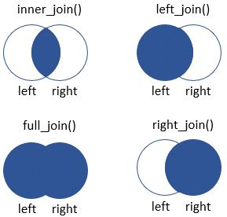

# Manipulate Data with `tidyverse`

The package `tidyverse` contains some useful packages to explore scientific data. In this section we will learn how manipulate this data, which usually is collected in tables or matrices. The objective of this season is provide useful tips and trips to use `tidyverse` and prepare data to visualize in `ggplot2`.

The structure of a table to be used in `ggplot2` is a classic table of records similar to our pheno_data table.

```{r}
pheno_data <- read.delim("../input_data/pheno_data.tsv")
head(pheno_data)
```
In each row we have different information about different samples or genes or so many combinations as you can imagine. In almost all the tutorial we will use this table of pheno_data.

## Prepare set up

We should install `tidyverse` library although it is usually installed with all the base R packages. After installing we should load it. Check that you have read the pheno_data table.

```{r}
library(tidyverse)
pheno_data <- read.delim("../input_data/pheno_data.tsv")
```

## Use pipes to build a super code

`tidiverse` package contains a lot of different libraries to manipulate and visualize data. The package `dplyr` is maybe the most useful of them. It includes a function to connect other function between them. This function is **%>%** and is known as "pipe". The pipe gets the result from a table (or vector) and send to another function below. The use of pipes is extremely recommended because the codes appear to be super intuitive and easily to read.

To use a pipe you only need to put the "pipe function" after a table and before another function. You can concatenate as many pipes as you want. Here we would show some basics examples:

```{r}
pheno_data %>%
  head() %>%
  as.data.frame()

pheno_data %>%
  unique()

pheno_data %>%
  na.omit()
```

## Basic functions of `tidyverse`

We are going to explore some very useful functions built by `dplyr` (included in `tidyverse`). The main advantage of using `dplyr` is that makes data exploration and analysis faster and easier than using base R code. The main functions that provides `dplyr` are **select()**, **rename()**, **filter()**, **arrange()**, **mutate()**, **group_by()**, **summarize()** and **join()**. Although these are the more important, there are much more of them. All these functions are similar to SQL query code. If you are familiarized with SQL queries you will catch `dplyr` quickly.

### Select desired variables

We use the function **select()** to select variables from a table that we want to keep. This is very useful when you have several columns and you only need some of them. In the **select()** function you only need to input the data variable and the set of columns that you want to filter.

```{r}
pheno_data %>%
  # Select title and individual
  select(title, individual) %>%
  head()
```

**select()** allows select a set of variables inside a range. For example, we can select from the first column (title) to the fourth column (disease_state) including the columns that are between them.

```{r}
pheno_data %>%
  # Select columns between title and disease_state
  select(title:disease_state) %>%
  head()
```
In addition we can drop a variable from a table. This is useful when we only want to drop a few columns.

```{r}
pheno_data %>%
  # Remove title and individual columns
  select(-title,-individual) %>%
  head()
```

One trip of using **select()** is order the columns as we want.

```{r}
pheno_data %>%
  # Not select anything, but the order of the columns changes
  select(individual, cell_type, disease_state, gender, title) %>%
  head()
```

### Rename a variable

Another useful function implemented in `dplyr` is **rename()**. That function change the name of a column (or more than one). You simply need to provide the new name.

```{r}
pheno_data %>%
  # Put the new name and equalise to the old name
  rename("title_new" = "title") %>%
  head()

pheno_data %>%
  # You can change some colnames
  rename("title_new" = "title", "cell_dex_new" = "cell_type") %>%
  head()
```

### Filter rows

In the most of the cases you will need to filter your data for any reason, that is, select the rows that meet one or more conditions. This process can be done with the function **filter()**.

```{r}
pheno_data %>%
  # Keep the rows with the cell_type different from "PBMC"
  filter(cell_type != "PBMC",
  # And with the disease_state equal to "Healthy control"
         disease_state == "Healthy control") %>%
  head()
```

The examples shows the use of **filter()** with only one criteria by query. However you can use the function **%in%** (or !**%in%** for inverse) to pick data from some values.

```{r}
pheno_data %>%
  # Keep the rows with individual 3139 or 3153
  filter(individual %in% c("3139","3153")) %>%
  head()

pheno_data %>%
  # Keep the rows that are different from 3139 or 3153
  filter(!individual %in% c("3139","3153")) %>%
  head()
```


### Create a new variable

Usually you will need to create one or more new columns. These columns can be created from external data (a vector) or from the current data. The function **mutate()** allows to create easily some new variables (numeric, factor, boolean, character). Now, we will see some examples.

```{r}
# In that case we are going to save a new variable named pheno_data_with_dummy
pheno_data_with_dummy <- pheno_data %>%
  # Use mutate to create numeric variable named dummyVar
  mutate(dummyVar = rnorm(nrow(pheno_data)),
         # another numeric variable named dummyVar2
         dummyVar2 = rnorm(nrow(pheno_data), mean = 5),
         # Calculate the product of dummyVar and dummyVar2
         product = dummyVar*dummyVar2,
         # Create a character variable join two variables with paste0
         cell_dex = paste0(cell_type,"_",individual),
         # Reuse an existing variable and convert to factor
         cell_type = factor(cell_type),
         # Reuse an existing variable and conver into to boolean
         gender = ifelse(gender == "Female",T,F))

pheno_data_with_dummy %>%
  head()
```
### Sort table

You can sort a table based on one or more columns with the function **arrange()**. Some uses are:

```{r}
pheno_data_with_dummy %>%
  # numeric variable sorted ascending
  arrange(product) %>%
  head()

pheno_data_with_dummy %>%
  # numeric variable sorted descending (function desc())
  arrange(desc(product)) %>%
  head()

pheno_data_with_dummy %>%
  # character variable sorted from A to Z
  arrange(disease_state) %>%
  head()

pheno_data_with_dummy %>%
  # character variable sorted from Z to A
  arrange(desc(disease_state)) %>%
  head()

pheno_data_with_dummy %>%
  # character variable sorted asc.
  arrange(disease_state,
  # numeric variable sorted desc.
          desc(product)) %>%
  head()
```

## Aggregate variables and summarize

Now we are going to use two different functions that are connected. These functions are **summarize()** and **group_by()**. These functions are different from the previous ones. While functions as **select()** or **filter()** do not change the structure of the table, **summarize()** and **group_by()** modify the table structure. It is more understanding with an example.

```{r}
pheno_data_with_dummy %>%
  summarize(mean_dummy = mean(dummyVar),
            mean_dummy2 = mean(dummyVar2))
```
Now the result is a new table with the summarized data that we have required. We have lost the original table. The function summarize works with all the functions from R or local that do any summary operation. This process can be done with numeric function as **mean()**, **var()**, **sum()** or with other functions sum up a variable. There is a function very similar to **summarize()** that is **summarize_at()**. We will see how it works and them we explain the differences.

```{r}
pheno_data_with_dummy %>%
  # We want to get the same stats from two columns inside vars()
  summarise_at(vars(dummyVar, dummyVar2),
  # The list of functions are mean and median
               list(~mean(.),~median(.)))
  # Important keep the structure: ~function(.)
```
The function do the same than **summarize()** but is more efficient when you want to do some operations. The symbols `.` and `~` are methods implemented in `purrr` package (included also in `tidyverse`).

The other function is **group_by()**. This function is use to aggregate the categories from one or more columns. For example, instead of calculate the mean value of dummyVar for all samples, we can calculate the mean value of dummyVar aggregating by cell_type. That is, we get a mean value for each category of cell_type. The code below shows the functionality of **group_by()**.

```{r}
pheno_data_with_dummy %>%
  group_by(cell_type) %>%
  summarise(mean_value = mean(dummyVar))
```

That returns a table with the different mean values according to cell_type. **group_by()** allows to do all the combinations that we want, for example the mean values according to cell_type and gender. Ypu only need to add gender column to **group_by()**

```{r}
pheno_data_with_dummy %>%
  group_by(cell_type, gender) %>%
  summarise(mean_value = mean(dummyVar))
```
Can you imagine do that operation without **group_by()**? Of course you can do it with bucles, for example. And the code would look too massive.

```{r}
results <- data.frame(cell_type = 0, gender = 0, mean = 0)[0,]
for (cell_type in unique(pheno_data_with_dummy$cell_type)){
  for (gender in unique(pheno_data_with_dummy$gender)){
    meta_data_filt <- pheno_data_with_dummy[pheno_data_with_dummy$cell_type == cell_type & pheno_data_with_dummy$gender == gender,]
    results <- rbind(results, data.frame(cell_type = cell_type,
                                         gender = gender,
                                         mean = mean(meta_data_filt$dummyVar)))
  }
}

print(results)
```
The results are the same! We think that from now you are going to use **group_by()** and **summarize()** without doubts.

Another functionality of **group_by()** and **summarize()** is count the number of rows that meet the aggregation. You can use the function **n()** to do it.

```{r}
pheno_data %>%
  group_by(cell_type, gender) %>%
  summarize(n = n())

# Alternative: use count() instead of summarize()
pheno_data %>%
  group_by(cell_type, gender) %>%
  count()
```

With **group_by()** there is other function that works perfect. That function is **do()**. This function compute between groups. For example, we want to keep the **head()** of the table, but showing the head(3) by group.

```{r}
pheno_data %>%
  group_by(cell_type) %>%
  do(head(.,3))
```

## Join two datasets

Many times we need to join two tables that share one or more columns. To explain how we can join two datasets with `dplyr` we are are going to use the gene_info and the results tables.

```{r}
results <- read.delim("../input_data/results_table.tsv")
gene_info <- read.delim("../input_data/gene_info.tsv")
```
There are some ways to join datasets. The four functions more used are **inner_join()**, **full_join()**, **left_join()** and **right_join()**. To understand the use of join functions imagine that the table that you can use is the left table and the table that you want to join is the right table. In the next figure you can observe how works each function.



To sum up, while **inner_join()** keep common rows in both tables,  **full_join()** all the rows, **left_join()** the rows that are in the left table and **right_join()** the rows in the right table. To observe the behaviour of these functions we are going to make some changes in the data.

```{r}
results_filt <- results %>%
  filter(log2FoldChange > 1)

gene_info_filt <- gene_info %>%
  filter(chromosome_name == "X")
```

The left table is going to be results_filt and the right table will be gene_info_filt. To use these functions, you need to declare which is the key column, the column that can join both datasets. In this case, the key of left table is "gene" and the key of right table is "ensembl_gene_id".

We start with **inner_join()**. We only select rows that match both tables. In this case, those rows with a log2FoldChange value greater than 1 from left table and rows with chromosome_name == "X" from right table.

```{r}
results_filt %>%
  inner_join(gene_info_filt, by = c("gene" = "ensembl_gene_id")) %>%
  head()
```

**full_join()** joins both tables completely. Missing rows are converted to NAs.

```{r}
results_filt %>%
  full_join(gene_info_filt, by = c("gene" = "ensembl_gene_id")) %>%
  head()

results_filt %>%
  full_join(gene_info_filt, by = c("gene" = "ensembl_gene_id")) %>%
  tail()
```

Both **left_join()** and **right_join()** function priorizates the left (only rows with log2FoldChange > 1) and right (only rows with chromosome_name == "X") tables respectively.

```{r}
# We use gene_info to have all chromosome_name possibilities
results_filt %>%
  left_join(gene_info, by = c("gene" = "ensembl_gene_id")) %>%
  head()

# We use results to have rows with all log2FoldChange values
results %>%
  right_join(gene_info_filt, by = c("gene" = "ensembl_gene_id")) %>%
  head()
```

## Pivot tables

Until now, the tables that we have used are tables of records that can be used in `ggplot2`. However, many times we have data in other format, for example in a matrix. That the case of gene expression data, where genes are in rows and samples in columns. The expression value is the cell that match each gene and sample. This format is not allowed to be used in `ggplot2`. We need to change the format to have a table with each combination of gene and sample in one row. Maybe the next image can be useful for you.


As you can see, the two functions that we are going to explain are **pivot_longer()** to convert matrix data into table format and **pivot_wider()** to do the contrary.

In the input_data folder we have a matrix table. First we read it and modify a little to have a real matrix table. We will use a new function from `tibble` package that is **column_to_rownames()**. This fucntion convert one column into rownames. The contrary function is **rownames_to_column()**. In addition we need to make some changes in the colnames because we have a "X" before the real name. To do this we will use the functions **rename_all()** and **str_replace_all()** from `stringr` package.

```{r}
norm_counts <- read.delim("../input_data/normalized_counts.tsv")
head(norm_counts[,1:5])

norm_counts <- norm_counts %>%
  column_to_rownames("gene") %>%
  rename_all(funs(stringr::str_replace_all(., 'X', '')))

head(norm_counts[,1:5])
```

Now, we are going to use **pivot_longer()** to build a table ready for `ggplot2`. The first thing is convert rownames to column named "gene". Then apply **pivot_longer()**. This functions need at least 3 parameters: *cols* (column names that are going to be used. In our case are all colnames from the matrix), *names_to* (name of variable that contains colnames. In our cases "sample") and *value_to* (name that take the value. In our case is "expression").

```{r}
extended_data <- norm_counts %>%
  rownames_to_column("gene") %>%
  pivot_longer(cols = colnames(norm_counts),
               names_to = "sample",
               values_to = "expression")

extended_data %>%
  head()
```

The new extended_data object can be used in `ggplot2`.

In order to revert the table to build the original matrix we use **pivot_wider()**. In this case we need the parameters *names_from* (contrary to *names_to*) and *values_from* (counter to *values_to*).

```{r}
matrix_data <- extended_data %>%
  pivot_wider(names_from = "sample",
              values_from = "expression") %>%
  column_to_rownames("gene")

head(matrix_data[,1:5])
```

## Advances examples

We have learnt the basic functionalities of `tidyverse` in the manipulation of data tables. Now, we are going to propose some advanced examples or exercises to put all together. First, we will describe the objective of the example and them we will put the code.

Be sure that you have read the four tables (and preprocess expression matrix).

```{r}
norm_counts <- read.delim("../input_data/normalized_counts.tsv") %>%
  column_to_rownames("gene") %>%
  rename_all(funs(stringr::str_replace_all(., 'X', '')))

results <- read.delim("../input_data/results_table.tsv")
gene_info <- read.delim("../input_data/gene_info.tsv")
pheno_data <- read.delim("../input_data/pheno_data.tsv")
```

Keep in mind that the columns that connections the tables are the following:


### Example 1

Filter genes that do not have hgnc_symbol (hgnc_symbol != "" from gene_info) of genes with pvalue < 0.05 and log2FoldChange > 0 (from results table), sorting the table from more to less log2FoldChange. Show hgnc_symbol, log2FoldChange and pvalue.

```{r}
gene_info %>%
  filter(hgnc_symbol != "") %>%
  inner_join(results, by = c("ensembl_gene_id" = "gene")) %>%
  filter(log2FoldChange > 1, pvalue < 0.05) %>%
  arrange(desc(log2FoldChange)) %>%
  select(hgnc_symbol, log2FoldChange, pvalue)
```
### Example 2

Calculate the mean, median, min and max expression (norm_counts) of each gene from chromosome 1 (chromosome_name == "1", from gene_info) aggregating by disease_state (pheno_data).

```{r}
norm_counts %>%
  rownames_to_column("gene") %>%
  pivot_longer(cols = colnames(norm_counts),
               names_to = "sample",
               values_to = "expression") %>%
  inner_join(gene_info, by = c("gene" = "ensembl_gene_id")) %>%
  filter(chromosome_name == "1") %>%
  inner_join(pheno_data, by = c("sample" = "title")) %>%
  group_by(disease_state, gene) %>%
  summarize(mean = mean(expression),
          median = median(expression),
          min = min(expression),
          max = max(expression))
```

### Example 3

Show the difference of mean of expression from chromosomes 1,2 and 3 between Alzheimer and Healthy. Sort the results by difference.

```{r}
norm_counts %>%
  rownames_to_column("gene") %>%
  pivot_longer(cols = colnames(norm_counts),
               names_to = "sample",
               values_to = "expression") %>%
  inner_join(pheno_data, by = c("sample" = "title")) %>%
  inner_join(gene_info, by = c("gene" = "ensembl_gene_id")) %>%
  filter(chromosome_name %in% c("1","2","3")) %>%
  group_by(gene, disease_state) %>%
  summarize(mean_expr = mean(expression)) %>%
  pivot_wider(names_from = "disease_state", values_from = "mean_expr") %>%
  mutate(diff_mean = `Alzheimer's disease` - `Healthy control`) %>%
  select(gene, diff_mean) %>%
  left_join(gene_info, by = c("gene" = "ensembl_gene_id")) %>%
  arrange(desc(diff_mean)) %>%
  head()
```