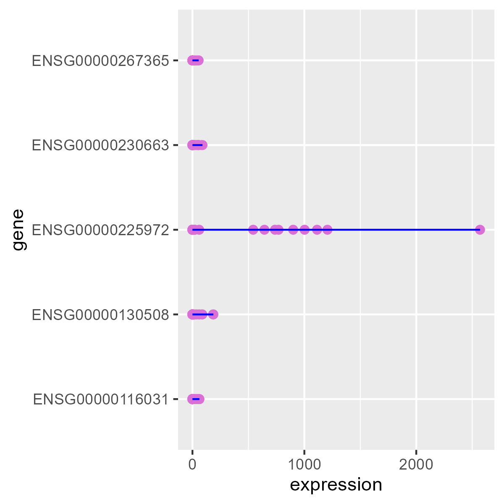
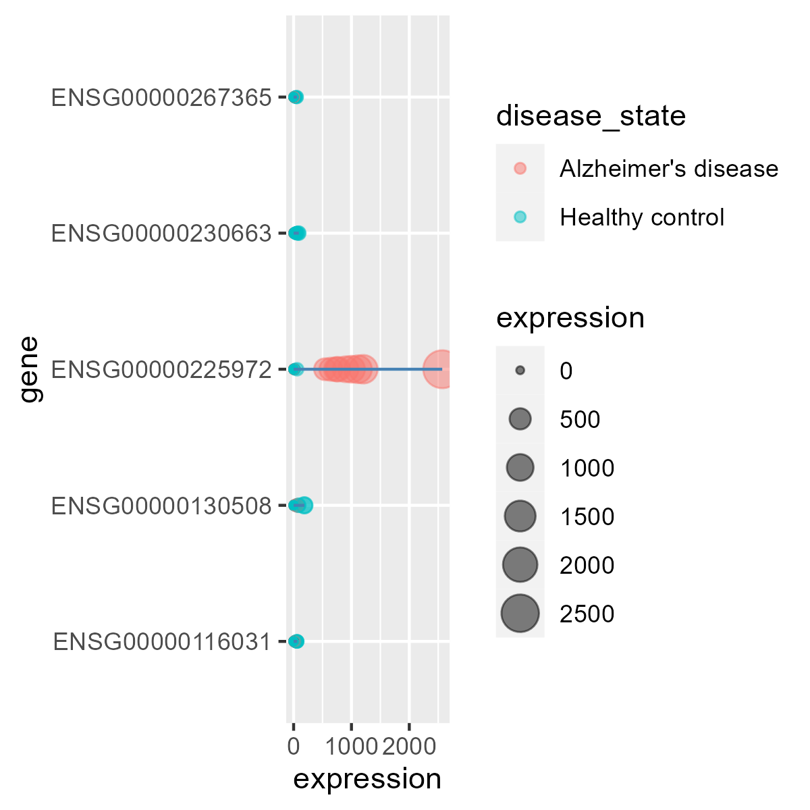
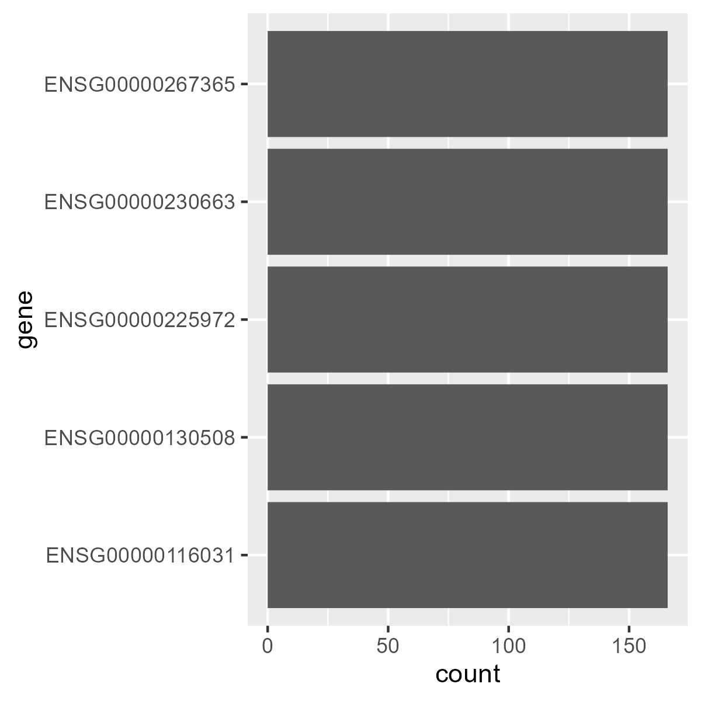

# Visualize Data with `tidyverse`

The package `tidyverse` contains some useful packages to explore scientific data. In this season we will learn the basic concepts of `ggplot2` to visualize your data.

In the previous season we have learnt how manipulate the data with `dplyr` and `tibble` to prepare the tables for it use in `ggplot2`. The structure of a table that need `ggplot2` is a tidy table, containing all the records and its characteristics in the rows. The table pheno_data can serve as an example.

```{r}
pheno_data <- read.delim("../input_data/pheno_data.tsv")
head(pheno_data)
```

## Prepare set up

Prepare `tidyverse` and read all the tables from input_data.

```{r}
library(tidyverse)
norm_counts <- read.delim("../input_data/normalized_counts.tsv") %>%
  column_to_rownames("gene") %>%
  rename_all(funs(stringr::str_replace_all(., 'X', '')))
extended_data <- norm_counts %>%
  rownames_to_column("gene") %>%
  pivot_longer(cols = colnames(norm_counts),
               names_to = "sample",
               values_to = "expression")

results <- read.delim("../input_data/results_table.tsv")
gene_info <- read.delim("../input_data/gene_info.tsv")
pheno_data <- read.delim("../input_data/pheno_data.tsv")
```

## `ggplot2` uses layers to decompose the graphics

This section contains some theory about how works `ggplot2`. We will know the basic concepts such us how is built `ggplot2` and make our first plots. `ggplot2` follows the idea of *grammar of graphics*. This idea decompose a graphic in several layers or components. However, there are only four essential layer to plot informative graphics:

- **data** the dataset to be plotted
- **mapping** how map your dataset
- **geometries** visual elements for your data
- **statistics** representation of your data

The are other layers such as **theme**, **facet**, **coordinates**, and **scales**.

## The four essential elements of `ggplot2`

We only need the four essential elements of `ggplot2` to produce an informative graphic. These layers are: **data** (which is introduced in **ggplot()**), **mapping** (that is defined in **ggplot()** and in the geom functions), **geometry** (when you choose the geometries) and **statistics** (that control the representation of geometries).

We will use the next dataset:

```{r}
table_to_use <- results %>%
  arrange(desc(abs(log2FoldChange))) %>%
  head(5) %>%
  inner_join(extended_data) %>%
  inner_join(pheno_data, by = c("sample"="title")) %>%
  inner_join(gene_info, by = c("gene"="ensembl_gene_id"))

str(table_to_use)

# 'data.frame':	830 obs. of  15 variables:
#   $ baseMean       : num  17.7 17.7 17.7 17.7 17.7 ...
# $ log2FoldChange : num  4.62 4.62 4.62 4.62 4.62 ...
# $ lfcSE          : num  0.528 0.528 0.528 0.528 0.528 ...
# $ stat           : num  8.75 8.75 8.75 8.75 8.75 ...
# $ pvalue         : num  2.21e-18 2.21e-18 2.21e-18 2.21e-18 2.21e-18 ...
# $ padj           : num  8.53e-14 8.53e-14 8.53e-14 8.53e-14 8.53e-14 ...
# $ gene           : chr  "ENSG00000225972" "ENSG00000225972" "ENSG00000225972" "ENSG00000225972" ...
# $ sample         : chr  "2950_PBMC" "2951_PBMC" "2965_PBMC" "2964_PBMC" ...
# $ expression     : num  2.216 0 0 0.918 0 ...
# $ individual     : int  2950 2951 2965 2964 3015 2972 3019 3022 3114 3115 ...
# $ cell_type      : chr  "PBMC" "PBMC" "PBMC" "PBMC" ...
# $ disease_state  : chr  "Healthy control" "Healthy control" "Healthy control" "Healthy control" ...
# $ gender         : chr  "Male" "Female" "Female" "Female" ...
# $ hgnc_symbol    : chr  "MTND1P23" "MTND1P23" "MTND1P23" "MTND1P23" ...
# $ chromosome_name: chr  "1" "1" "1" "1" ...
```

To make the first plot, define the variable *gene* to the `y` axis and the variable *expression* to `x` axis and use **geom_point()** to generate a scater plot.

```{r}
ggplot(data = table_to_use, mapping = aes(y = gene, x = expression))+
  geom_point()
```

<p style="text-align:center;"></p>

We can modify some properties of the **geometry** such as color or size, and add more than one layer to our plot, for example a line that connect the points.

```{r}
ggplot(data = table_to_use, mapping = aes(y = gene, x = expression))+
  geom_point(size = 2, color = "orchid")+
  geom_line(color = "blue")
```

<p style="text-align:center;"></p>

How can we modify the plot to color points or change the size based on conditional values? To answer this question we will need to use the **mapping**. For example if we want to color the points by *disease_state* variable and change the size based on *expression* variable we can do it declaring the aesthetics.

```{r}
ggplot(data = table_to_use, mapping = aes(y = gene, x = expression))+
  geom_point(aes(color = disease_state, size = expression), alpha = 0.5)+
  geom_line(color = "steelblue")
```

<p style="text-align:center;"></p>

Now, each point that belongs to Alzheimer samples is filled in red and the Healthy samples are filled in blue. In addition, the different values of *Wexpression* are used to control the size of the points.

Not all variables can be mapped in the same way. For example, *size* or *alpha* can only be used with continuous variables, while *shape* or *linetype* are used with categorical variables.

This code returns a error because of this.

```{r}
ggplot(data = table_to_use, mapping = aes(y = gene, x = expression))+
  geom_point(aes(shape = expression), alpha = 0.5)+
  geom_line(color = "steelblue")
```

There are a lot of **geometries** and properties that can be mapped in all of them. We will see some of them but you will need to consult the help function a lot of times.

You may have notice that we talked about four different layers that were indispensable to plot a figure with `ggplot2`. But we have only seen three of them and we have plotted some figures. What about **statistics**? This layer is implicity declare in the geom functions. Each geom function has a different statistics by default. When you look for the help of **geom_point()** function you will see a parameter that is stat (**statistics** label). In the case of **geom_point()**, **geom_text()**, **geom_line()** and others this stat is "identity". This means that `x` and `y` mapping should be defined by the user. However there are other geom functions that use different stat. For example, the **geom_bar()** use the stat "count". What "count" means? It means that you have to introduce only one of `x` or `y` axis. The other will be calculated by the count function. We can see with an example.

```{r}
ggplot(data = table_to_use, mapping = aes(y = gene))+
  geom_bar()
```
<p style="text-align:center;"></p>

We use **geom_bar()** to count the number of times that happen the aesthetic that we select. In this case, **geom_bar** calculate the number of rows that have the different levels of *gene* variable.

Of course, we can change the stat of a function and repply the same that do **geom_bar()** by hand. There is a alternative function, **geom_col()** that do the same that **geom_bar()** but with the stat "identity" and the plot will be the same.

```{r}
table_count <- table_to_use %>%
  group_by(gene) %>%
  count()

ggplot(table_count, aes(y = gene, x = n))+
  geom_bar(stat = "identity")

ggplot(table_count, aes(y = gene, x = n))+
  geom_col()
```
There are other functions that have different stat for example **geom_density()** uses stat "density" or **geom_boxplot()** uses stat "boxplot".

## Starting to customize graphics

Although you only need the four essential layers of `ggplot2` to plot a graph, the graphics that we have plotted are very primitive. `ggplot2` provides a lot of manners of modifying your graphs using the rest of layers. We will approach all of them.

### Scales

Scales are used in order to change the properties on how we map the datasets. The most common scale change that users nomally do is changing the color or the size of a geom or change the axis scales.

#### Scale axis

All the scale functions that are used to change the axis are named **scale_x/y_X()** where X can be a type of scale such as *continuous*, *log10*, *square* or *reverse*.

We are going to use one of the previous plot in order to change both axis scales.


## Customize graphics

Once we have explained the basic of `ggplot2`, we can start to learn how customize graphics with `ggplot2`. For this purpose we will produce some figures that are usually used in the field of Bioinformatics. Instead of explain the theory we will practice with some examples. Each one includes different skills that we will learn.

The graphics are:

- Volcano Plot. Representation of differential expression analysis. In the `y` axis we put the -log(pvalue) and in the `x` axis we put the log2FoldChange. The representation is make with points. These points will have colored with a diverging palette (you can change it) based on the log2FoldChange value and sized by -log(pvalue). In addition we will add text to the 10 most significant genes. The result should be:

<p style="text-align:center;"></p>

### Volcano Plot (points, color, scales, text)

Representation of differential expression analysis. In the `y` axis we put the -log(pvalue) and in the `x` axis we put the log2FoldChange. The representation is make with points. These points will have colored with a diverging palette (you can change it) based on the log2FoldChange value and sized by -log(pvalue). In addition we will add text to the 10 most significant genes.

The starting plot will be saved in "p" object.

```{r}
results_text <- results %>%
  arrange(padj) %>%
  head(10)

p <- ggplot()+
  geom_point(data = results,
             aes(x = log2FoldChange, y = -log(pvalue),
                 fill = log2FoldChange, size = -log(pvalue)),
             shape = 21, color = "black")+
  geom_text(data = results_text,
            aes(x = log2FoldChange, y = -log(pvalue),label = gene),
            size = 1.5, nudge_y = 1, nudge_x = 1)
p
```
<p style="text-align:center;"></p>

We just know how to declare aesthetic as size, color and `x` and `y` position. We also understand how introduce different datasets in our plot and setting some properties. There two new things that we did not know previously. The first is that now we control the color of the points with fill instaead of the color. That is due to we have changed the shape to 21. This shape is a filled point, so the fill reflects the color of the point and the color is the border color. The second new thing is the addition of nudge_x and nudge_y to geom_text. This is used to insert spaces (nudge_x = 1, 1 unit to right and nudge_y = 1, 1 unit to up) to separate label from points.

#### Scale color and size

The first new thing that we are going to apply is change the color set. In this case, the color is scaled by a numeric variable (log2FoldChange) and that variable is diverging (has values lower and greater than 0). `ggplot2` has very function to scale colors and a lot of extensions of `ggplot2` produces several of palettes. In this occasion we are going to use two of them and you will select your favorite. We can use **scale_fill_distiller(type = "div")** that use prebuilt palettes or create or own palette with **scale_fill_gradient2()**.

```{r}
p + scale_fill_distiller(type = "div")
p + scale_fill_gradient2(low = "darkgreen", mid = "white", high = "orchid")
```

<p style="text-align:center;"></p>

<p style="text-align:center;"></p>

In addition, the size of the points is excessive. By default, the size of a geom object has a range from 1 to 6. We can change this range as we want. In this case we would like to reduce the maximum range value to 4. We can do this with **scale_size()** function.

```{r}
p + scale_fill_distiller(type = "div")+
  scale_size(range = c(1,4))
```

<p style="text-align:center;"></p>

#### Change theme

One of the layers more used to make customized plots with `ggplot2` is the **theme**. This layer is the one that controls the appearance of the plot. You can modify a lot of aspects of your plot changing the **theme**. Examples of elements that can be changed are: aspect of axis text or axis title, lines in the axis, the legend size and position... `ggplot2` has some pre-built themes that can be used.

```{r}
p + scale_fill_distiller(type = "div")+
  scale_size(range = c(1,4))+
  theme_minimal()

p + scale_fill_distiller(type = "div")+
  scale_size(range = c(1,4))+
  theme_classic()

p + scale_fill_distiller(type = "div")+
  scale_size(range = c(1,4))+
  theme_bw()
```
<p style="text-align:center;"></p>

<p style="text-align:center;"></p>

<p style="text-align:center;"></p>

Besides these pre-built functions (there are a lot of them), you can define you own **theme** using the function **theme()**. All the parameters of **theme()** function must be used with some the element_() functions. There are four main element functions: element_blank() used to remove the element, element_rect() to modify a rectangle, element_text() to modify a text and element_line() to modify a line. In the next example we will use all of them:

```{r}
p + scale_fill_distiller(type = "div")+
  scale_size(range = c(1,4))+
  theme(
    axis.text = element_text(size = 8), # Change axis text size of both axis to 8
    axis.title.x = element_text(size = 9), # Change axis title size of y axis to 9
    axis.line = element_line(color = "blue"), # Put lines on axis
    legend.key = element_rect(fill = "white"), # Change the box color of legend to white
    panel.background = element_blank() # remove background of the panel
  )
```

<p style="text-align:center;"></p>

For our plot we will define the next **theme**.

```{r}
p + scale_fill_distiller(type = "div")+
  scale_size(range = c(1,4))+
  theme(
    axis.text = element_text(size = 8),
    axis.title = element_text(size = 9),
    axis.line = element_line(),
    legend.key = element_rect(fill = "white"),
    panel.background = element_blank(),
    legend.key.size = unit(0.2,"cm"),
    legend.text = element_text(size = 8),
    legend.title = element_text(size = 9)
  )
```

<p style="text-align:center;"></p>


#### Text Repel

As you can see, the text for some genes are overlapped. You can reduce that effect using a package derived from `ggplot2`. This package is `ggrepel` and has a function called **geom_text_repel()** that do the same than **geom_text()** but look for a better disposition of text in order to avoid overlapping.

```{r}
library(ggrepel)
p <- ggplot()+
  geom_point(data = results,
             aes(x = log2FoldChange, y = -log(pvalue),
                 color = log2FoldChange, size = -log(pvalue)))+
  geom_text_repel(data = results_text,
            aes(x = log2FoldChange, y = -log(pvalue),label = gene),
            size = 1.5)+
  scale_fill_distiller(type = "div")+
  scale_size(range = c(1,4))+
  theme(
    axis.text = element_text(size = 8),
    axis.title = element_text(size = 9),
    axis.line = element_line(),
    legend.key = element_rect(fill = "white"),
    panel.background = element_blank(),
    legend.key.size = unit(0.2,"cm"),
    legend.text = element_text(size = 8),
    legend.title = element_text(size = 9)
  )

p
```

<p style="text-align:center;"></p>


## Starting to customize graphics

Until now, we have seen only the very basic of `ggplot2`, how it works and how we can define some aspects of the plot. However there are four more layers that we need to customize the plot as we want: **scales**, **theme**, **facet** and **coordinates**.

### Scales

Everything inside the **mapping** are scaled. As we have seen, `x` and `y` axis are scaled from minimum to maximum values (numeric or categorical), colors are scaled with a palette of colors (red, blue, green), and size are scaled from minimum to maximum value too. This scales are by default defined by `ggplot2` but we can change them with some scales functions.

These scales functions are named as: **scale_"aes property"_"type"()**, where aes property is color, or x, or y and type is the type of transformation like continuous, manual or gradient.

#### Scaling color and fill

Color and fill are properties that are use to give different palette of colors to the plot. Each geometry have color or fill properties or both. For example, **geom_bar()** have color and fill properties. While color is used to the border of the bar, fill is used to fill the bar.

```{r}
ggplot(pheno_data, aes(x = cell_type, color = gender, fill = disease_state))+
  geom_bar()
```

<p style="text-align:center;"></p>

As you can see fill and color give a different palette color to the variables that we have selected. But the color defined by default by `ggplot2` are usually not informative. In this case is very difficult differentiate color and fill because the colors are the same.

##### Categorical data

We can use scales to change color or fill or both of them. There are a lot of scale_color_ and scale_fill_ functions and they can be used for different types of data. In this case, color and fill reflect categorical data, so we will need a scale function that regulates categorical data. For example **scale_color_brewer()** and **scale_fill_brewer()** includes some color schemes for sequential, diverging and qualitative scales from `ColorBrewer`. You only need to recognise the type of data that you have and select the palette that you want (see the help).

```{r}
ggplot(pheno_data, aes(x = cell_type, color = gender, fill = disease_state))+
  geom_bar()+
  scale_fill_brewer(type = "qual", palette = "Dark2")+
  scale_color_brewer(type = "qual", palette = "Set3")
```
<p style="text-align:center;"></p>

But in several times you would prefer to choose your custom palette. In the case of categorical data, you can use **scale_color_manual()** and **scale_fill_manual()** where you can select the color of each category.

```{r}
ggplot(pheno_data, aes(x = cell_type, color = gender, fill = disease_state))+
  geom_bar()+
  scale_fill_manual(values = c("Alzheimer's disease" = "gray70",
                               "Healthy control" = "gray30"))+
  scale_color_manual(values = c("Female" = "orange",
                                "Male" = "darkblue"))
```

<p style="text-align:center;"></p>

##### Numeric variable

However, sometimes you will need to scale colors in sequential (from 0 to X) or diverging (from -X to X). In both cases the variable to scale should be numeric. There are some function to scale the color of numeric variables but we will use: **scale_"fill or color"_distriller()**, changing the type from "qual" to "div" (diverging) or "seq" (sequential) and **scale_"fill or color"_gradient()** for sequential and **scale_"fill or color"_gradient2()** for diverging. To show how use them we will use the next data:

```{r}
results_filt_genes <- results_filt %>%
  filter(pvalue < 0.05, abs(log2FoldChange) > 0.5) %>%
  arrange(desc(abs(log2FoldChange))) %>%
  head(10)

ggplot(results_filt_genes, aes(y = ensembl_gene_id, x = -log(pvalue)))+
  geom_col(aes(fill = -log(pvalue)))+
  geom_point(aes(color = log2FoldChange), size = 3)+
  scale_fill_distiller(type = "div", palette = "PiYG")+
  scale_fill_distiller(type = "seq", palette = "YlOrBr", direction = 1)
```
<p style="text-align:center;"></p>

```{r}
ggplot(results_filt_genes, aes(y = ensembl_gene_id, x = -log(pvalue)))+
  geom_col(aes(fill = -log(pvalue)))+
  geom_point(aes(color = log2FoldChange), size = 3)+
  scale_color_gradient2(low = "darkgreen", high = "firebrick") +
  scale_fill_gradient(low = "gray80", high = "steelblue")
```

<p style="text-align:center;"></p>


#### Scale x and y axis

In some occasions, we will need to scale the scale of one or both axis in order to deal with outliers or simply because we want to remark some specific values.

There are some ways to change the scale of the axis. We will use as example the next data and figure.

```{r}
ggplot(results_filt, aes(y = -log(pvalue), x = log2FoldChange))+
  geom_point(aes(color = log2FoldChange), size = 1.5)+
  scale_fill_distiller(type = "div")
```

<p style="text-align:center;"></p>

##### Limits

The most common approach to scale the axis is reducing or increasing the limits. We can do it with the functions **scale_"x or y"_continuous()**. This function has a parameter *limits* that is a vector in which we define the min an the max value that we want to to plot. It is useful to zoom in some area.

```{r}
ggplot(results_filt, aes(y = -log(pvalue), x = log2FoldChange))+
  geom_point(aes(color = log2FoldChange), size = 1.5)+
  scale_fill_distiller(type = "div")+
  scale_y_continuous(limits = c(0,5))
```

You will receive a warning that informs about the lost of 30 points (those with a -log(pvalue) > 5)

<p style="text-align:center;"></p>

You can do the same with functions **xlim()** and **ylim()**.

##### Expansions

As you can see, `ggplot2` does not use the min and max value to start the plot. It chooses little margin both vertical and horizontal axis. To remove or increase these margins you have to modify the expansion. This can be done with the functions **scale_"x or y"_continuous()**, that have a parameter *expand*, similar to limits. In order to explain how works *expand* we will play with *limits* and *expand*

```{r}
ggplot(results_filt, aes(y = -log(pvalue), x = log2FoldChange))+
  geom_point(aes(color = log2FoldChange), size = 1.5)+
  scale_fill_distiller(type = "div")+
  scale_y_continuous(limits = c(0, 10),
                     expand = expansion(mult = c(0, 0.5),
                                           add = c(0, -3)))

# bottom position will be 0 - (10-0) * 0.0  -0 = 0,
# top position will be 10 + (10-0) * 0.5 +(-3) = 12
```

<p style="text-align:center;"></p>


##### Breaks

You can also select the location of marks from an axis using the parameters *breaks* of function **scale_"x or y"_continuous()**.

```{r}
ggplot(results_filt, aes(y = -log(pvalue), x = log2FoldChange))+
  geom_point(aes(color = log2FoldChange), size = 1.5)+
  scale_fill_distiller(type = "div")+
  scale_x_continuous(breaks = c(-1,0,1)) # Only show -1,0,1
```

<p style="text-align:center;"></p>

Or setting the breaks with a range

```{r}
ggplot(results_filt, aes(y = -log(pvalue), x = log2FoldChange))+
  geom_point(aes(color = log2FoldChange), size = 1.5)+
  scale_fill_distiller(type = "div")+
  scale_x_continuous(breaks = scales::breaks_width(0.5)) # Each 0.5
```
<p style="text-align:center;"></p>

##### Transformation

Finally we can transform the axis into a different scale. You can reverse the scale, transform to logarithmic or squared scale. By default, the parameter *trans* is set to "identity" and we can choose several different transformation like "log10", "sqrt" or "reverse"

```{r}
ggplot(results_filt, aes(y = -log(pvalue), x = log2FoldChange))+
  geom_point(aes(color = log2FoldChange), size = 1.5)+
  scale_fill_distiller(type = "div")+
  scale_y_continuous(trans = "log10")

ggplot(results_filt, aes(y = -log(pvalue), x = log2FoldChange))+
  geom_point(aes(color = log2FoldChange), size = 1.5)+
  scale_fill_distiller(type = "div")+
  scale_y_continuous(trans = "sqrt")

ggplot(results_filt, aes(y = -log(pvalue), x = log2FoldChange))+
  geom_point(aes(color = log2FoldChange), size = 1.5)+
  scale_fill_distiller(type = "div")+
  scale_y_continuous(trans = "reverse")
```
<p style="text-align:center;"></p>

#### Scale size, alpha, shape, linetype

You can scale with **scale_"aes object"_"type"()** functions a lot of properties of the graphics. In this example we will display the scaling of size and alpha, but the other aes properties follows similar behaviour. Do not forget to check the help from the functions.

##### Size

Instead of selecting the same size for all the points, we are going to introduce size as an aesthetic that depends on the value of -log(pvalue).

```{r}
ggplot(results_filt, aes(y = -log(pvalue), x = log2FoldChange))+
  geom_point(aes(color = log2FoldChange, size = -log(pvalue)))+
  scale_fill_distiller(type = "div")
```

<p style="text-align:center;"></p>

The size of the points is already scaled by default, from 1 to 6. But maybe you want to change the scale. Only use the **scale_size_continuous()** function to change the scale. Imagine you want to make the points greater, change the range.

```{r}
ggplot(results_filt, aes(y = -log(pvalue), x = log2FoldChange))+
  geom_point(aes(color = log2FoldChange, size = -log(pvalue)))+
  scale_fill_distiller(type = "div")+
  scale_size_continuous(range = c(3,10))
```
<p style="text-align:center;"></p>

##### Alpha

Alpha works similar than size, with the function **scale_alpha_continuous()**. By default the range is from 0.1 to 1. But we can change. To visualize better the change, we reverse the range from 1 to 0.1.

```{r}
ggplot(results_filt, aes(y = -log(pvalue), x = log2FoldChange))+
  geom_point(aes(color = log2FoldChange, size = -log(pvalue), alpha = -log(pvalue)))+
  scale_fill_distiller(type = "div")+
  scale_alpha_continuous(range = c(1,0.1))
```
<p style="text-align:center;"></p>


Of course we can explain much more about scales, but it will be a proper course.

### Facets

Facets are used to split the graphic in multiple plot in order to improve or detail the visualization and is a good way to avoid over plotting. For example, and following with our point plot, we can split the graphic according to chromosome_name. To facet a plot there are two functions. **facet_wrap()** and **facet_grid()**.

#### facet_wrap

```{r}
ggplot(results_filt, aes(y = -log(pvalue), x = log2FoldChange))+
  geom_point(aes(color = log2FoldChange))+
  scale_fill_distiller(type = "div")+
  facet_wrap(~chromosome_name)
```
<p style="text-align:center;"></p>

By this way you can check in which chromosome are located the more interested genes (the outlier in this case). By default, **facet_wrap()** maintain the same scale in all the splitted plot, but we can change it.

```{r}
ggplot(results_filt, aes(y = -log(pvalue), x = log2FoldChange))+
  geom_point(aes(color = log2FoldChange))+
  scale_fill_distiller(type = "div")+
  facet_wrap(~chromosome_name, scales = "free_y")
```

Setting scales to fre_y, cobvert each splitted plot with one determinated scale in the axis `y`.

<p style="text-align:center;"></p>

#### facet_grid

**facet_grid()** allows to do graphic pivots.

```{r}
ggplot(results_filt, aes(y = -log(pvalue), x = log2FoldChange))+
  geom_point(aes(color = log2FoldChange))+
  scale_fill_distiller(type = "div")+
  facet_grid(significant~chromosome_name)
```
<p style="text-align:center;"></p> -->
