# Visualize Data with `tidyverse`

The package `tidyverse` contains some useful packages to explore scientific data. In this season we will learn the basic concepts of `ggplot2` to visualize your data.

In the previous season we have learnt how manipulate the data with `dplyr` and `tibble` to prepare the tables for it use in `ggplot2`. The structure of a table that need `ggplot2` is a tidy table, containing all the records and its characteristics in the rows. The table pheno_data can serve as an example.

```{r}
pheno_data <- read.delim("../input_data/pheno_data.tsv")
head(pheno_data)
```

## Prepare set up

Prepare `tidyverse` and read all the tables from input_data.

```{r}
library(tidyverse)
norm_counts <- read.delim("../input_data/normalized_counts.tsv") %>%
  column_to_rownames("gene") %>%
  rename_all(funs(stringr::str_replace_all(., 'X', '')))
extended_data <- norm_counts %>%
  rownames_to_column("gene") %>%
  pivot_longer(cols = colnames(norm_counts),
               names_to = "sample",
               values_to = "expression")

results <- read.delim("../input_data/results_table.tsv")
gene_info <- read.delim("../input_data/gene_info.tsv")
pheno_data <- read.delim("../input_data/pheno_data.tsv")
```

## Basic concepts of `ggplot2`

This section contains some theory about how works `ggplot2`. We will know the basic concepts such us how is built `ggplot2` and make our first plots. `ggplot2` follows the idea of *grammar of graphics*. This idea decompose a graphic in several layers or components. Each layer has a purpose and normally is connected to other layers. We can define up to 8 layers that uses `ggplot2`, but we only need four of them to make an informative figure. These four layers are: **data**, **mapping**, **geometries** and **statistics**.

The other layers are: **facet**, **theme**, **scales** and **coordinates** but we will see them in the future.

### Data

Is the dataset with all the information that we need to plot the information. It should be in tidy table format and all you need to prepare the data is collected in the previous sesion. Data is included in `ggplot2` through the function **ggplot(data = your_dataset)**. If we use this function alone, `ggplot2` will plot a total empty figure.

```{r}
ggplot(data = pheno_data)
```

To make sure that the information is plotted correctly, we need to declare and use both **mapping** and **geometries** or **statistics**.

### Mapping

Is the declaration of what we want to plot from the **data**. By this parameter, also includes in **ggplot(data = your_dataset, mapping = aes(your aesthetics))** function, you choose how the data should be plotted. To do that, you have to use **aes()** function. The most important aesthetics normally are the `x` and `y` coordinates. With **aes()** function you declare what variables are the `x` and `y` coordinates. With **data** and **mapping** the plot changes but is not still informative. Now we only have the `x` and `y` axis.

```{r}
ggplot(data = results, mapping = aes(y = log2FoldChange, x = baseMean))
```

### Geometries

With this layer, we say to `ggplot2` how interpret the **data** and the **mapping**. We only need to decide which type of geometrical object is going to be plotted, like points, lines, bars, box plots, violin plots, text... With the previous example, we are going to plot the **data** and **mapping** with points (**geom_point()** function). We can do by three different ways. And the way can be important when the plot is complicated. We will see very soon the importance of how we declare the aesthetics.

```{r}
# Most conventional. Declare data and mapping in ggplot()
# Used when all the layers are going to use the same data and mapping
ggplot(results, aes(y = log2FoldChange, x = baseMean)) +
  geom_point()

# Declare data in ggplot and mapping in geom function
# Used when all the data will use the same data but different mapping
ggplot(results) +
  geom_point(aes(y = log2FoldChange, x = baseMean))

# Declare data and mapping in geom function
# Used when layers will use different data and mapping
ggplot() +
  geom_point(data = results, aes(y = log2FoldChange, x = baseMean))
```

The three ways makes exactly the same plot.

<p style="text-align:center;">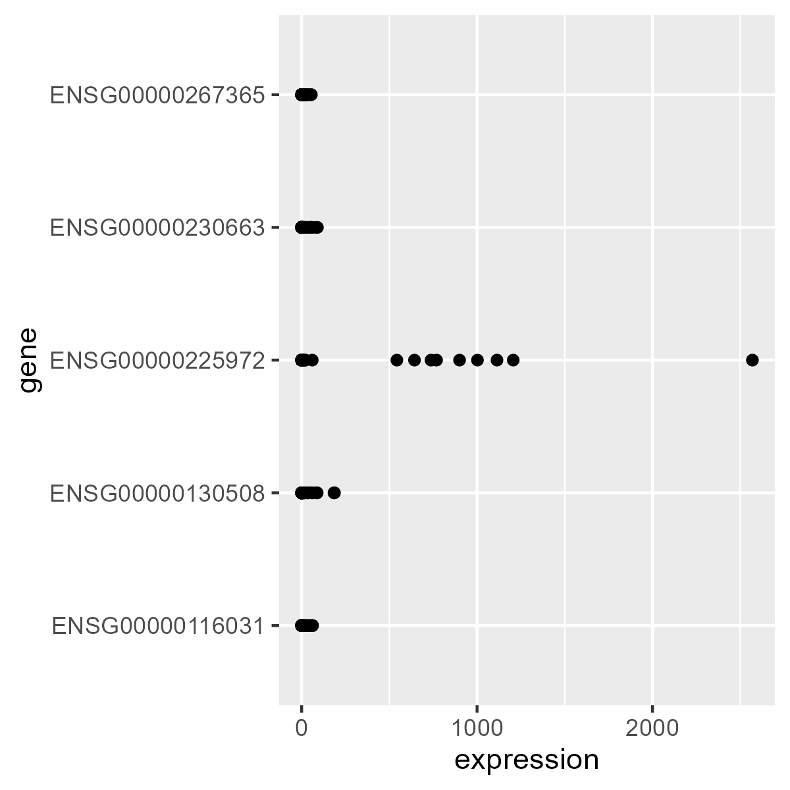</p>

Now we are going to explain the differences of the three ways. Imagine that we want to plot only results from chromosomes 1, 2 and 3 and create a new variable that label gene as significant or not (pvalue < 0.05 and abs(log2FoldChange) > 0.5). First, using `dplyr` filter the gene_info and join to results. Try for yourself to practice more with `dplyr`.

```{r}
results_filt <- gene_info %>%
  filter(chromosome_name %in% c("1","2","3")) %>%
  inner_join(results, by = c("ensembl_gene_id" = "gene")) %>%
  mutate(significant = ifelse(padj < 0.05 & abs(log2FoldChange) > 0.5,"Significant","No Significant"))
```

Geometries have several properties that can be changed. For this example, we will change color and size of the points. In addition we can add as many layers as we want. For example we can add a **geom_line()** to plot a line that connect points. You can do it with conventional way.

```{r}
ggplot(results_filt, aes(x = log2FoldChange, y = -log(pvalue))) +
  geom_point(color = "blue", size = 3)+
  geom_line(color = "darkgreen")
```

<p style="text-align:center;">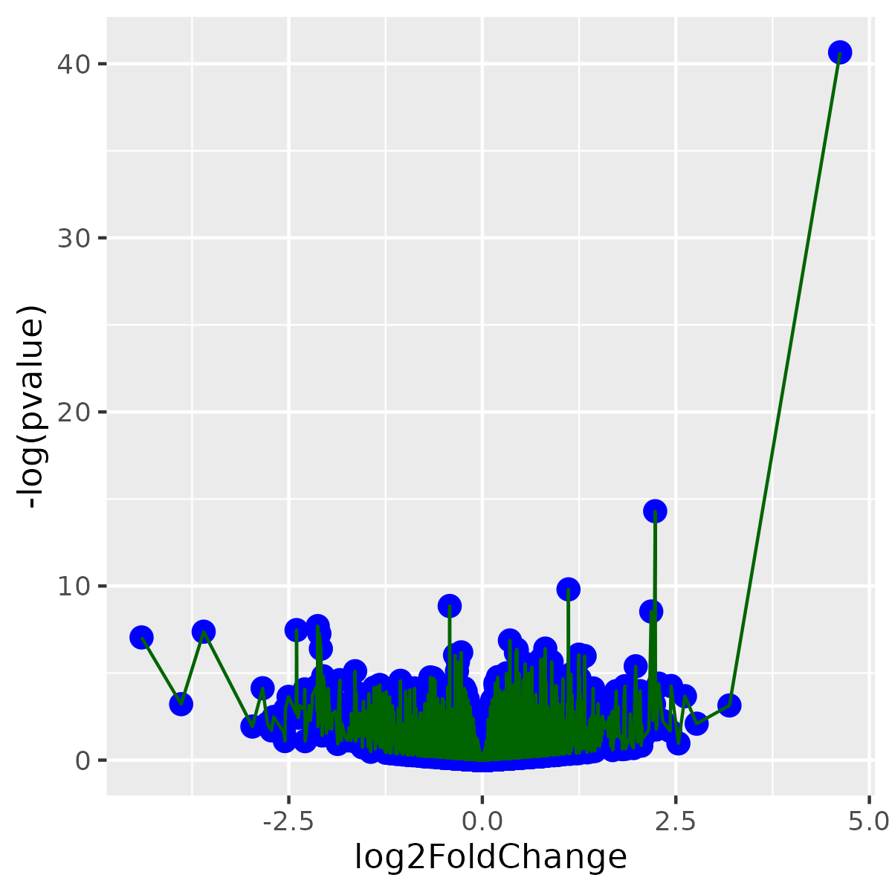</p>

Mapping can serve to differ condition. In the results_filt table we have three columns that define categorical variables (gene (not useful, a lot of them), chromosome_name and significant). The other variables are numeric. For example, we want to differ chromosome_name by a color.

```{r}
ggplot(results_filt, aes(x = log2FoldChange, y = -log(pvalue), color = chromosome_name)) +
  geom_point(size = 3)+
  geom_line()
```

<p style="text-align:center;">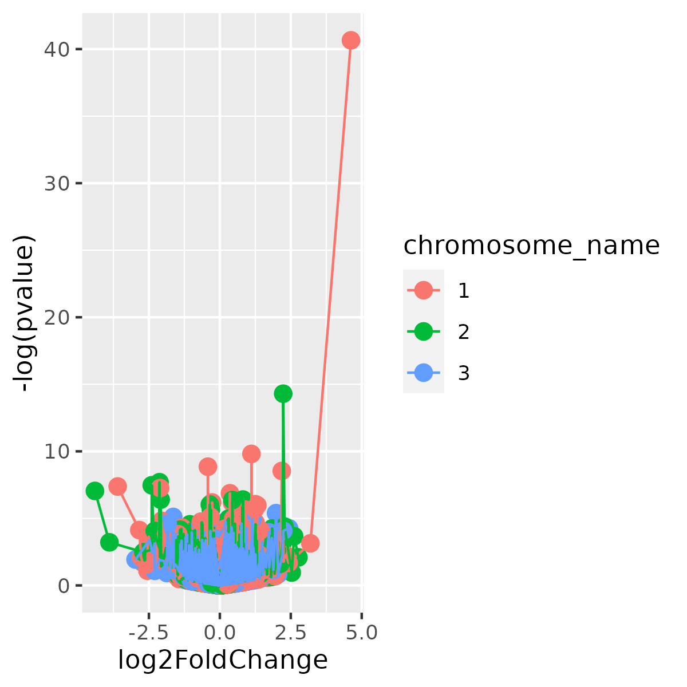</p>

As you can see both lines and points get the aesthetic color property. But what if we only want to color points in base of chromosome_name?. We need to declare aesthetic inside **geom_point()**. And with this method, we are using the second way to introduce data and mapping in `ggplot2`. In this occasion we will add a new aesthetic property, the size. Instead of plot all points with the same size, we can change sizes according to a numeric variable such as lfcSE, for example. As we will use the same `x` and `y` we only need to declare them in **ggplot()**, but size and mainly color should be declare in **geom_point()**

```{r}
ggplot(results_filt, aes(x = log2FoldChange, y = -log(pvalue))) +
  geom_point(aes(size = lfcSE, color = chromosome_name))+
  geom_line()
```

<p style="text-align:center;">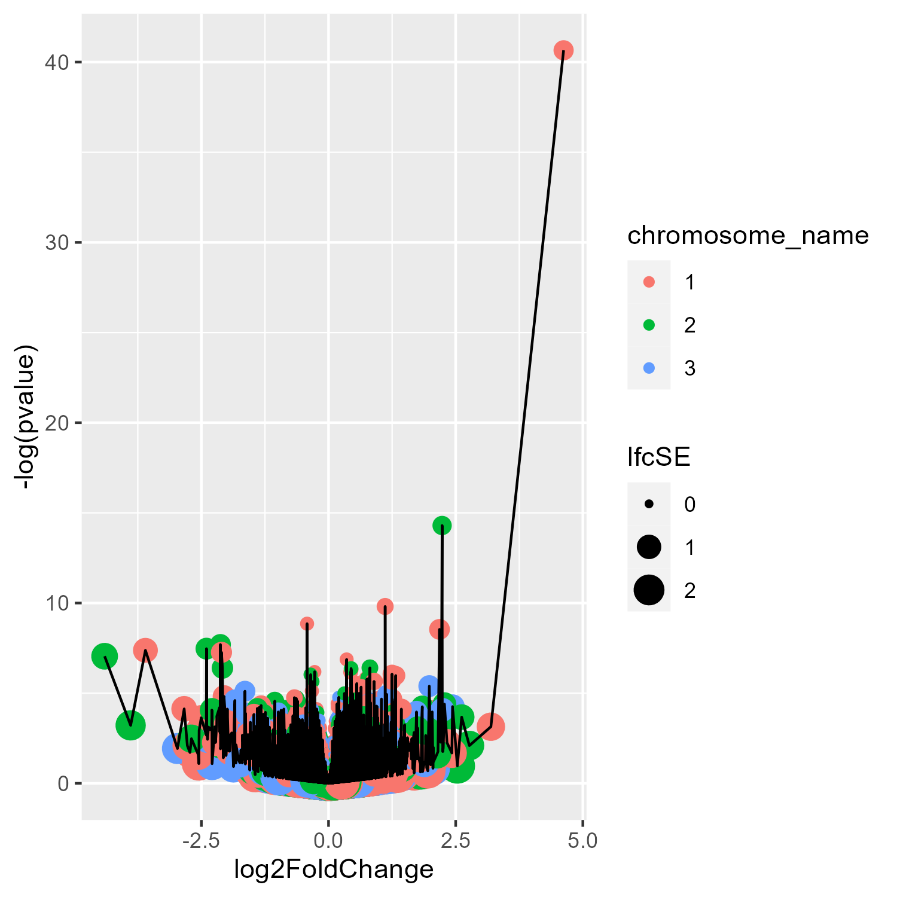</p>

The last way of introducing data (through geom functions) can be explained with an example of **geom_text()** function, that is used to write labels in the plot. In this example we wan to add labels from only significant genes. We can not include all the data in geom_text() because it will write all gene names.

```{r}
ggplot(results_filt, aes(x = log2FoldChange, y = -log(pvalue))) +
  geom_point(aes(size = lfcSE, color = chromosome_name))+
  geom_line()+
  geom_text(aes(label = ensembl_gene_id), size = 2)
```
<p style="text-align:center;">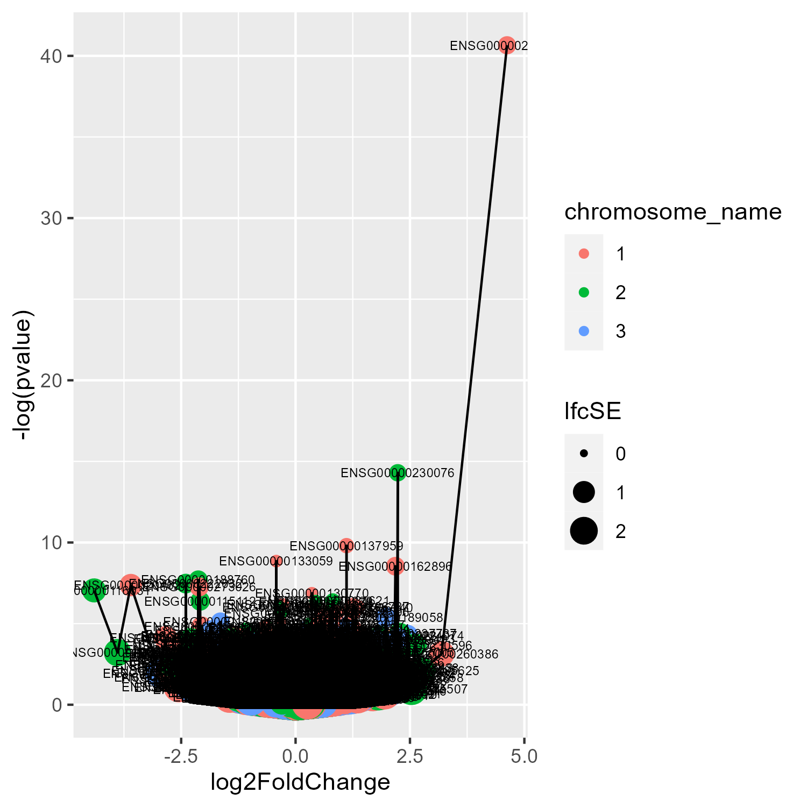</p>

That not what we want. We need to use different data for **geom_text()**. As other **mapping** are the same, it is not necessary to add in **geom_text()** but in occasion we would need to change them.

```{r}
results_filt_text <- results_filt %>%
  filter(significant == "Significant")

ggplot(results_filt, aes(x = log2FoldChange, y = -log(pvalue))) +
  geom_point(aes(size = lfcSE, color = chromosome_name))+
  geom_line()+
  geom_text(data = results_filt_text,aes(label = ensembl_gene_id), size = 2)
```

<p style="text-align:center;">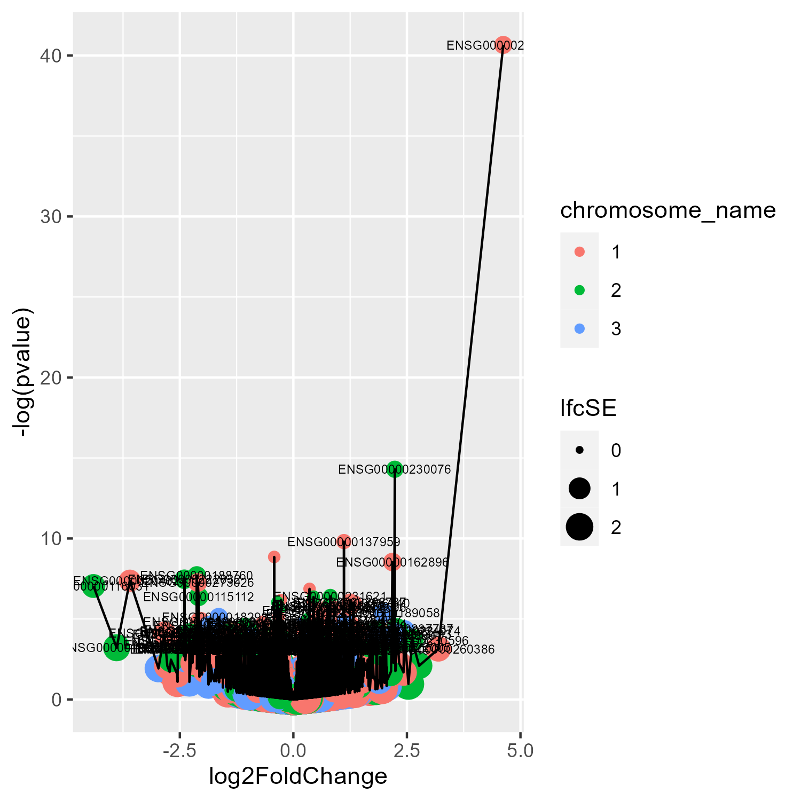</p>

That is what we wanted to plot. Until now, we have learnt how introduce data in `ggplot2`, how mapping some properties, how use some geometries and change the properties of them by setting (like color = "blue") or by aesthetic (like color = chromosome_name).

To finish with the basic concepts of geometries we will talk about the order. As you have seen, geometries are added by `+` one by one. `ggplot2` do not choose which geometry should be back or forward. The order in which they are introduced is the order in which they are plotted. In this case the order is: points in the back, lines over points and text over lines and points. If you want to change the order in which they are displayed, you only need to reorder them.

```{r}
ggplot(results_filt, aes(x = log2FoldChange, y = -log(pvalue))) +
  geom_text(data = results_filt_text,aes(label = ensembl_gene_id), size = 2)+
  geom_point(aes(size = lfcSE, color = chromosome_name))+
  geom_line()
```
<p style="text-align:center;">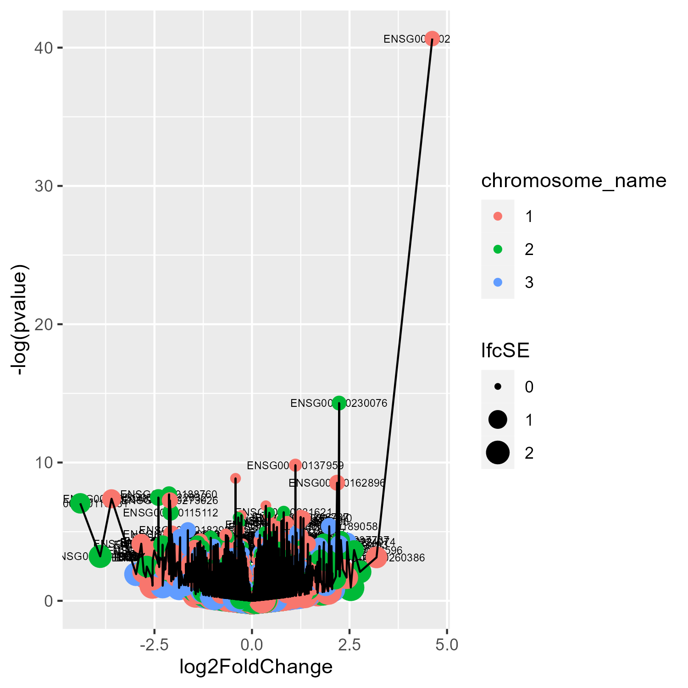</p>

Now the points are over lines and text.

### Statistics

You may have notice that we talked about four different layers that were indispensable to plot a figure with `ggplot2`. But we have only seen three of them and we have plotted several figures. What about **statistics**? Well, this layer is implicit declare in the geom functions. Each geom function have a different statistics. When you look for the help of **geom_point()** function you will see a parameter that is stat (**statistics** label). In the case of **geom_point()**, **geom_text()**, **geom_line()** and others this stat is "identity". This means that `x` and `y` mapping should be defined by the user. However there are other geom functions that use different stat. For example, the **geom_bar()** use the stat "count". What "count" means? It means that you have to introduce only one of `x` or `y` coordinates. The other will be calculated by the count function. We can see with an example.

```{r}
ggplot(pheno_data, aes(x = cell_type))+
  geom_bar()
```
<p style="text-align:center;">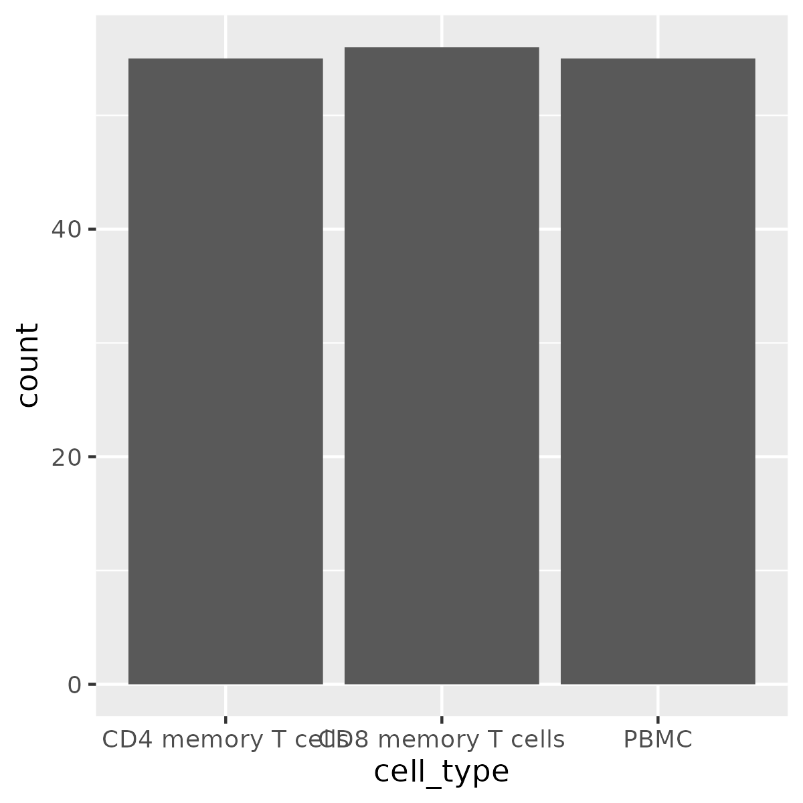</p>

We use **geom_bar()** to count the number of times that happen the aesthetic that we select. In this case, **geom_bar** calculate the number of rows that have the different levels of cell_type variable.

Of course, we can change the stat of a function and repply the same that do **geom_bar()** by hand. There is a alternative function, **geom_col()** that do the same that **geom_bar()** but with the stat "identity" and the plot will be the same.

```{r}
pheno_data_count <- pheno_data %>%
  group_by(cell_type) %>%
  count()

ggplot(pheno_data_count, aes(x = cell_type, y = n))+
  geom_bar(stat = "identity")

ggplot(pheno_data_count, aes(x = cell_type, y = n))+
  geom_col()
```
There are other functions that have different stat for example **geom_density()** uses stat "density" or **geom_boxplot()** uses stat "boxplot".

## Starting to customize graphics

Until now, we have seen only the very basic of `ggplot2`, how it works and how we can define some aspects of the plot. However there are four more layers that we need to customize the plot as we want: **scales**, **theme**, **facet** and **coordinates**.

### Scales

Everything inside the **mapping** are scaled. As we have seen, `x` and `y` axis are scaled from minimum to maximum values (numeric or categorical), colors are scaled with a palette of colors (red, blue, green), and size are scaled from minimum to maximum value too. This scales are by default defined by `ggplot2` but we can change them with some scales functions.

These scales functions are named as: **scale_"aes property"_"type"()**, where aes property is color, or x, or y and type is the type of transformation like continuous, manual or gradient.

#### Scaling color and fill

Color and fill are properties that are use to give different palette of colors to the plot. Each geometry have color or fill properties or both. For example, **geom_bar()** have color and fill properties. While color is used to the border of the bar, fill is used to fill the bar.

```{r}
ggplot(pheno_data, aes(x = cell_type, color = gender, fill = disease_state))+
  geom_bar()
```

<p style="text-align:center;"></p>

As you can see fill and color give a different palette color to the variables that we have selected. But the color defined by default by `ggplot2` are usually not informative. In this case is very difficult differentiate color and fill because the colors are the same.

##### Categorical data

We can use scales to change color or fill or both of them. There are a lot of scale_color_ and scale_fill_ functions and they can be used for different types of data. In this case, color and fill reflect categorical data, so we will need a scale function that regulates categorical data. For example **scale_color_brewer()** and **scale_fill_brewer()** includes some color schemes for sequential, diverging and qualitative scales from `ColorBrewer`. You only need to recognise the type of data that you have and select the palette that you want (see the help).

```{r}
ggplot(pheno_data, aes(x = cell_type, color = gender, fill = disease_state))+
  geom_bar()+
  scale_fill_brewer(type = "qual", palette = "Dark2")+
  scale_color_brewer(type = "qual", palette = "Set3")
```
<p style="text-align:center;">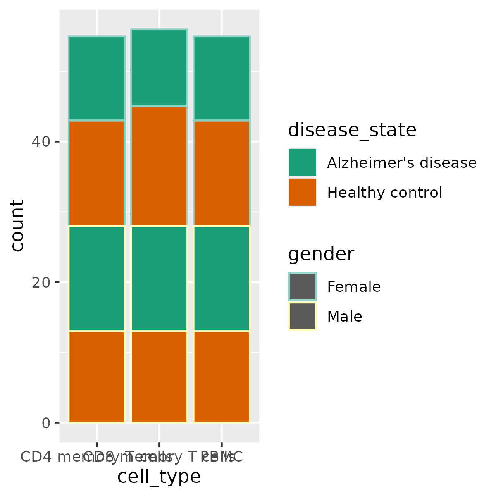</p>

But in several times you would prefer to choose your custom palette. In the case of categorical data, you can use **scale_color_manual()** and **scale_fill_manual()** where you can select the color of each category.

```{r}
ggplot(pheno_data, aes(x = cell_type, color = gender, fill = disease_state))+
  geom_bar()+
  scale_fill_manual(values = c("Alzheimer's disease" = "gray70",
                               "Healthy control" = "gray30"))+
  scale_color_manual(values = c("Female" = "orange",
                                "Male" = "darkblue"))
```

<p style="text-align:center;">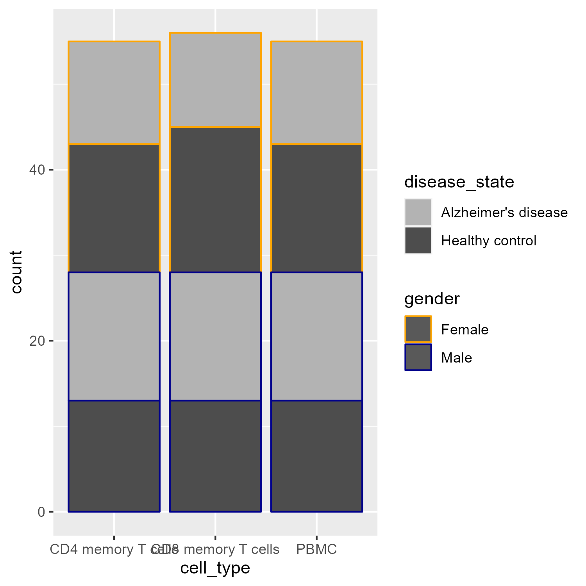</p>

##### Numeric variable

However, sometimes you will need to scale colors in sequential (from 0 to X) or diverging (from -X to X). In both cases the variable to scale should be numeric. There are some function to scale the color of numeric variables but we will use: **scale_"fill or color"_distriller()**, changing the type from "qual" to "div" (diverging) or "seq" (sequential) and **scale_"fill or color"_gradient()** for sequential and **scale_"fill or color"_gradient2()** for diverging. To show how use them we will use the next data:

```{r}
results_filt_genes <- results_filt %>%
  filter(pvalue < 0.05, abs(log2FoldChange) > 0.5) %>%
  arrange(desc(abs(log2FoldChange))) %>%
  head(10)

ggplot(results_filt_genes, aes(y = ensembl_gene_id, x = -log(pvalue)))+
  geom_col(aes(fill = -log(pvalue)))+
  geom_point(aes(color = log2FoldChange), size = 3)+
  scale_color_distiller(type = "div", palette = "PiYG")+
  scale_fill_distiller(type = "seq", palette = "YlOrBr", direction = 1)
```
<p style="text-align:center;">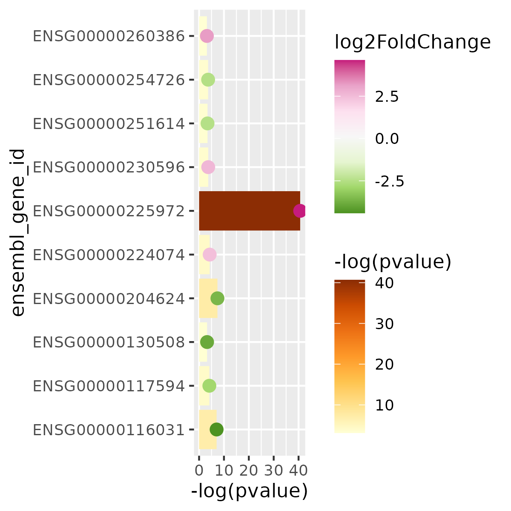</p>

```{r}
ggplot(results_filt_genes, aes(y = ensembl_gene_id, x = -log(pvalue)))+
  geom_col(aes(fill = -log(pvalue)))+
  geom_point(aes(color = log2FoldChange), size = 3)+
  scale_color_gradient2(low = "darkgreen", high = "firebrick") +
  scale_fill_gradient(low = "gray80", high = "steelblue")
```

<p style="text-align:center;">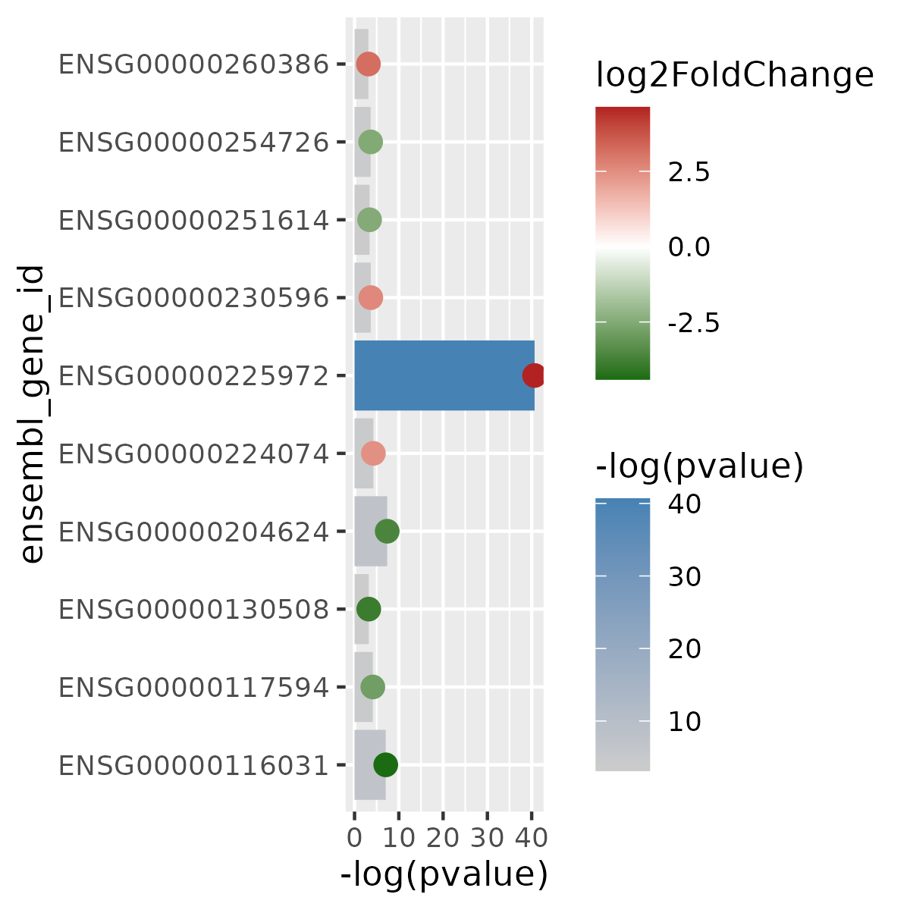</p>


#### Scale x and y axis

In some occasions, we will need to scale the scale of one or both axis in order to deal with outliers or simply because we want to remark some specific values.

There are some ways to change the scale of the axis. We will use as example the next data and figure.

```{r}
ggplot(results_filt, aes(y = -log(pvalue), x = log2FoldChange))+
  geom_point(aes(color = log2FoldChange), size = 1.5)+
  scale_color_distiller(type = "div")
```

<p style="text-align:center;">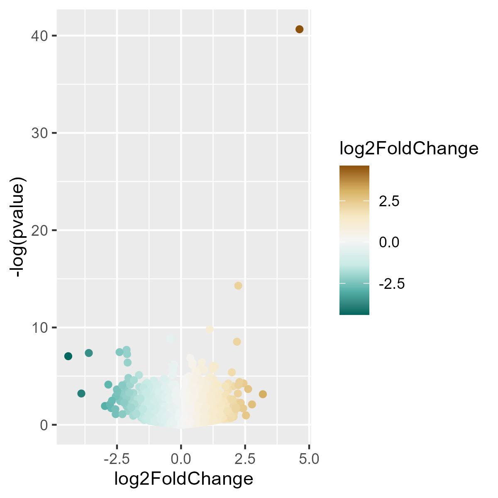</p>

##### Limits

The most common approach to scale the axis is reducing or increasing the limits. We can do it with the functions **scale_"x or y"_continuous()**. This function has a parameter *limits* that is a vector in which we define the min an the max value that we want to to plot. It is useful to zoom in some area.

```{r}
ggplot(results_filt, aes(y = -log(pvalue), x = log2FoldChange))+
  geom_point(aes(color = log2FoldChange), size = 1.5)+
  scale_color_distiller(type = "div")+
  scale_y_continuous(limits = c(0,5))
```

You will receive a warning that informs about the lost of 30 points (those with a -log(pvalue) > 5)

<p style="text-align:center;">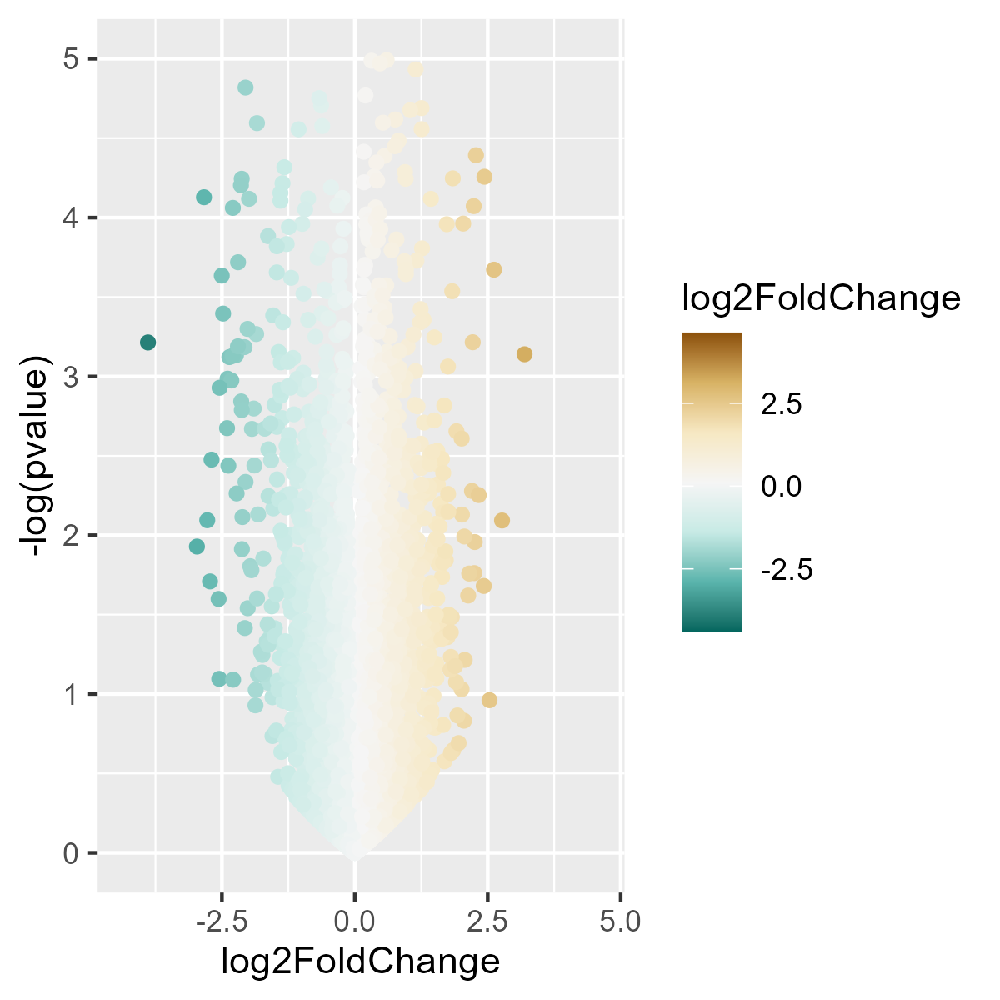</p>

You can do the same with functions **xlim()** and **ylim()**.

##### Expansions

As you can see, `ggplot2` does not use the min and max value to start the plot. It chooses little margin both vertical and horizontal axis. To remove or increase these margins you have to modify the expansion. This can be done with the functions **scale_"x or y"_continuous()**, that have a parameter *expand*, similar to limits. In order to explain how works *expand* we will play with *limits* and *expand*

```{r}
ggplot(results_filt, aes(y = -log(pvalue), x = log2FoldChange))+
  geom_point(aes(color = log2FoldChange), size = 1.5)+
  scale_color_distiller(type = "div")+
  scale_y_continuous(limits = c(0, 10),
                     expand = expansion(mult = c(0, 0.5),
                                           add = c(0, -3)))

# bottom position will be 0 - (10-0) * 0.0  -0 = 0,
# top position will be 10 + (10-0) * 0.5 +(-3) = 12
```

<p style="text-align:center;">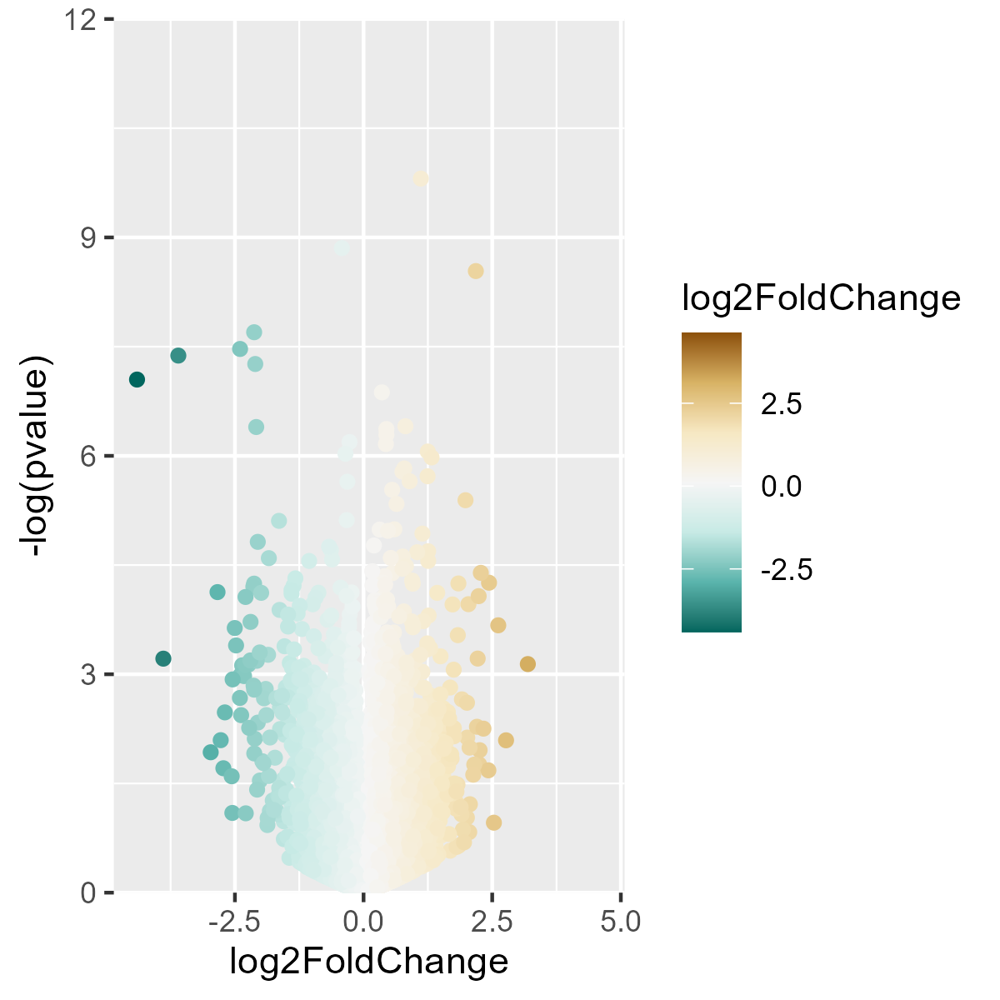</p>


##### Breaks

You can also select the location of marks from an axis using the parameters *breaks* of function **scale_"x or y"_continuous()**.

```{r}
ggplot(results_filt, aes(y = -log(pvalue), x = log2FoldChange))+
  geom_point(aes(color = log2FoldChange), size = 1.5)+
  scale_color_distiller(type = "div")+
  scale_x_continuous(breaks = c(-1,0,1)) # Only show -1,0,1
```

<p style="text-align:center;">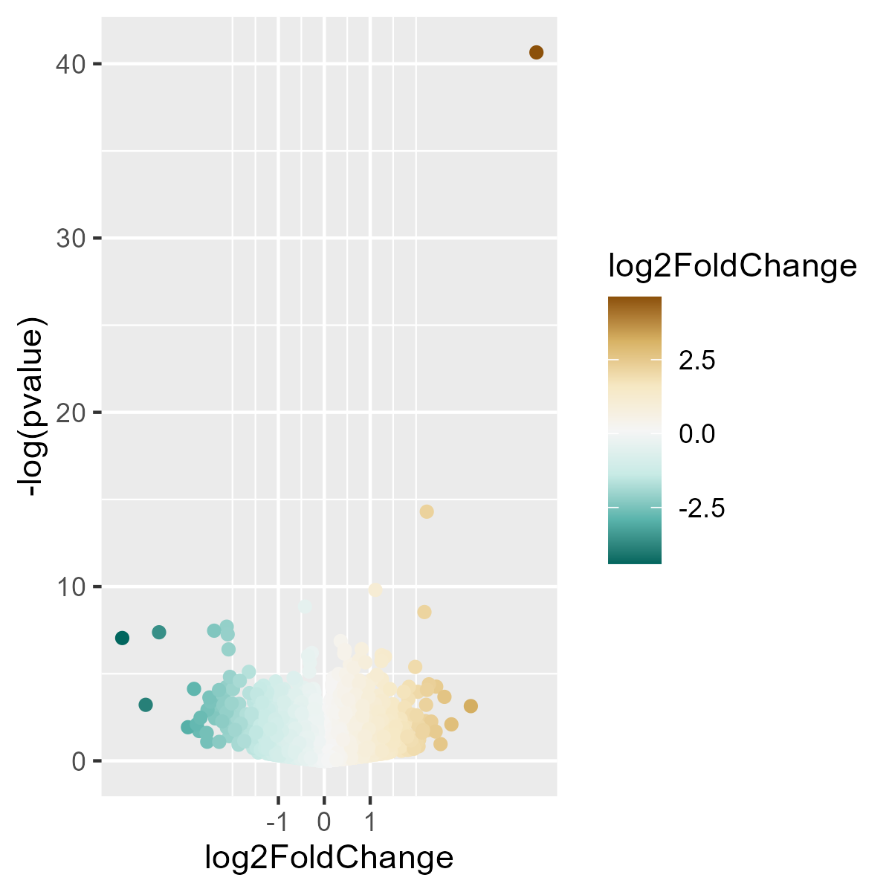</p>

Or setting the breaks with a range

```{r}
ggplot(results_filt, aes(y = -log(pvalue), x = log2FoldChange))+
  geom_point(aes(color = log2FoldChange), size = 1.5)+
  scale_color_distiller(type = "div")+
  scale_x_continuous(breaks = scales::breaks_width(0.5)) # Each 0.5
```
<p style="text-align:center;">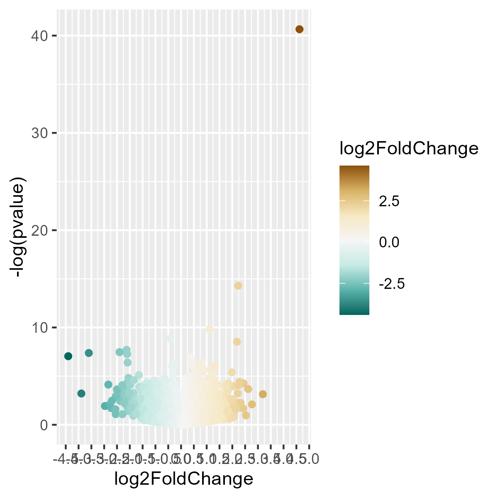</p>

##### Transformation

Finally we can transform the axis into a different scale. You can reverse the scale, transform to logarithmic or squared scale. By default, the parameter *trans* is set to "identity" and we can choose several different transformation like "log10", "sqrt" or "reverse"

```{r}
ggplot(results_filt, aes(y = -log(pvalue), x = log2FoldChange))+
  geom_point(aes(color = log2FoldChange), size = 1.5)+
  scale_color_distiller(type = "div")+
  scale_y_continuous(trans = "log10")

ggplot(results_filt, aes(y = -log(pvalue), x = log2FoldChange))+
  geom_point(aes(color = log2FoldChange), size = 1.5)+
  scale_color_distiller(type = "div")+
  scale_y_continuous(trans = "sqrt")

ggplot(results_filt, aes(y = -log(pvalue), x = log2FoldChange))+
  geom_point(aes(color = log2FoldChange), size = 1.5)+
  scale_color_distiller(type = "div")+
  scale_y_continuous(trans = "reverse")
```
<p style="text-align:center;">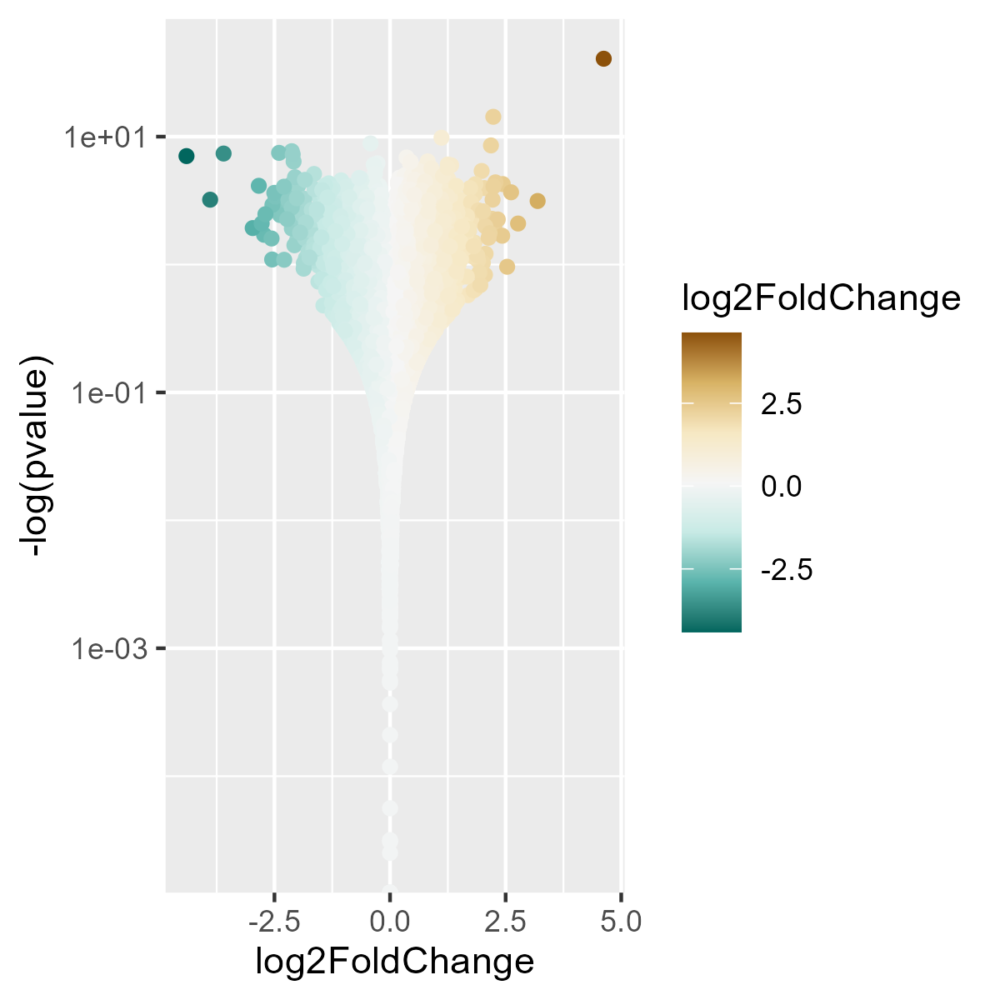</p>

#### Scale size, alpha, shape, linetype

You can scale with **scale_"aes object"_"type"()** functions a lot of properties of the graphics. In this example we will display the scaling of size and alpha, but the other aes properties follows similar behaviour. Do not forget to check the help from the functions.

##### Size

Instead of selecting the same size for all the points, we are going to introduce size as an aesthetic that depends on the value of -log(pvalue).

```{r}
ggplot(results_filt, aes(y = -log(pvalue), x = log2FoldChange))+
  geom_point(aes(color = log2FoldChange, size = -log(pvalue)))+
  scale_color_distiller(type = "div")
```

<p style="text-align:center;">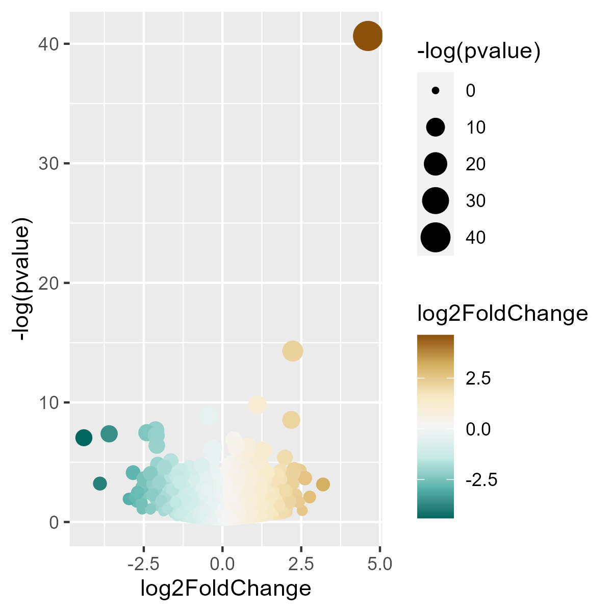</p>

The size of the points is already scaled by default, from 1 to 6. But maybe you want to change the scale. Only use the **scale_size_continuous()** function to change the scale. Imagine you want to make the points greater, change the range.

```{r}
ggplot(results_filt, aes(y = -log(pvalue), x = log2FoldChange))+
  geom_point(aes(color = log2FoldChange, size = -log(pvalue)))+
  scale_color_distiller(type = "div")+
  scale_size_continuous(range = c(3,10))
```
<p style="text-align:center;">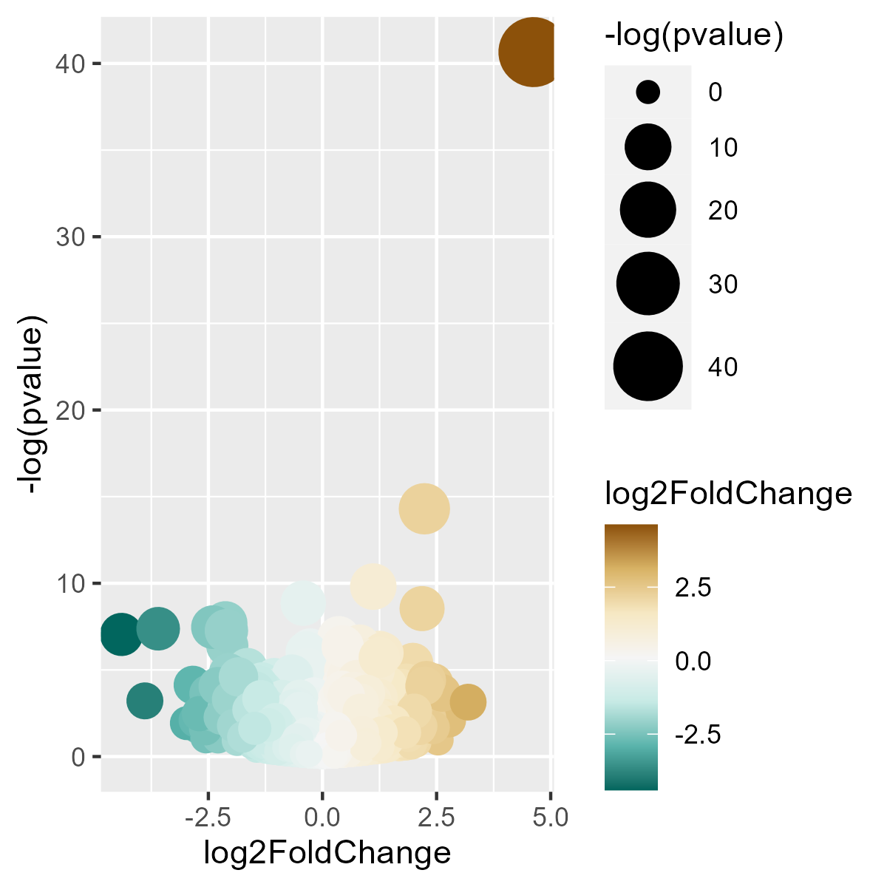</p>

##### Alpha

Alpha works similar than size, with the function **scale_alpha_continuous()**. By default the range is from 0.1 to 1. But we can change. To visualize better the change, we reverse the range from 1 to 0.1.

```{r}
ggplot(results_filt, aes(y = -log(pvalue), x = log2FoldChange))+
  geom_point(aes(color = log2FoldChange, size = -log(pvalue), alpha = -log(pvalue)))+
  scale_color_distiller(type = "div")+
  scale_alpha_continuous(range = c(1,0.1))
```
<p style="text-align:center;">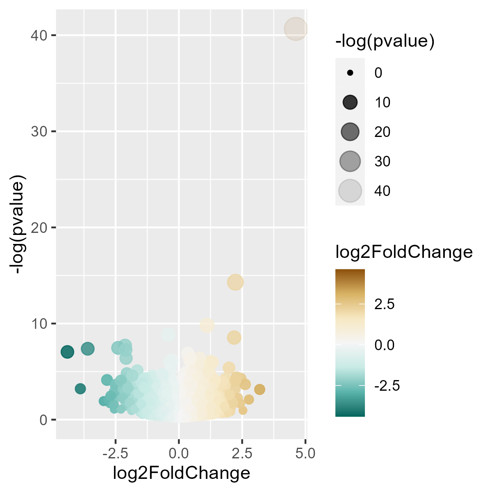</p>


Of course we can explain much more about scales, but it will be a proper course.

### Facets

Facets are used to split the graphic in multiple plot in order to improve or detail the visualization and is a good way to avoid over plotting. For example, and following with our point plot, we can split the graphic according to chromosome_name. To facet a plot there are two functions. **facet_wrap()** and **facet_grid()**.

#### facet_wrap

```{r}
ggplot(results_filt, aes(y = -log(pvalue), x = log2FoldChange))+
  geom_point(aes(color = log2FoldChange))+
  scale_color_distiller(type = "div")+
  facet_wrap(~chromosome_name)
```
<p style="text-align:center;">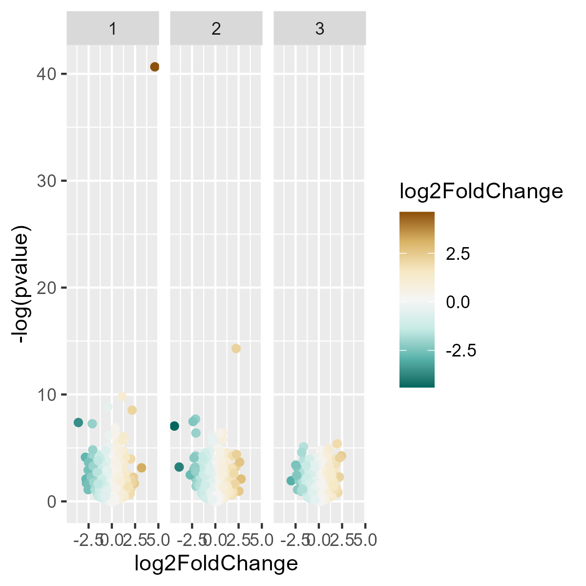</p>

By this way you can check in which chromosome are located the more interested genes (the outlier in this case). By default, **facet_wrap()** maintain the same scale in all the splitted plot, but we can change it.

```{r}
ggplot(results_filt, aes(y = -log(pvalue), x = log2FoldChange))+
  geom_point(aes(color = log2FoldChange))+
  scale_color_distiller(type = "div")+
  facet_wrap(~chromosome_name, scales = "free_y")
```

Setting scales to fre_y, cobvert each splitted plot with one determinated scale in the axis `y`.

<p style="text-align:center;">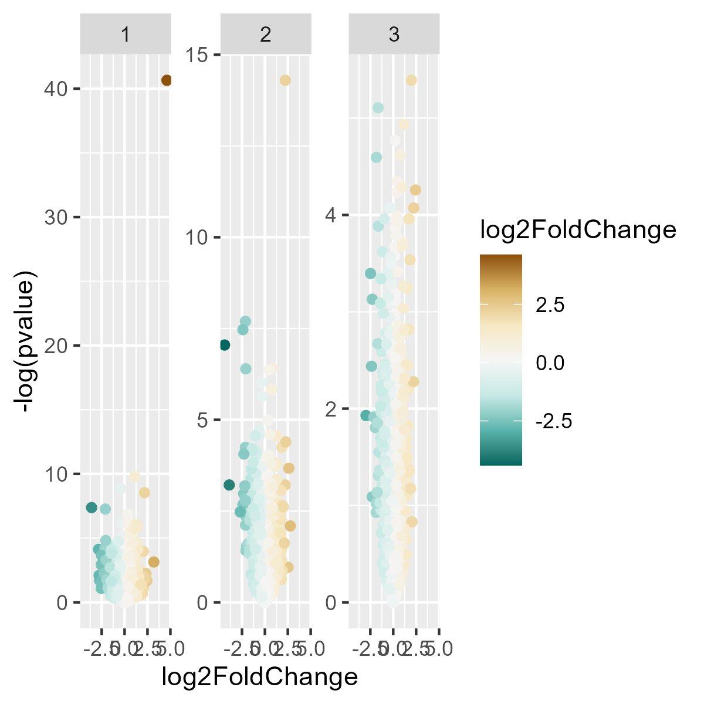</p>

#### facet_grid

**facet_grid()** allows to do graphic pivots.

```{r}
ggplot(results_filt, aes(y = -log(pvalue), x = log2FoldChange))+
  geom_point(aes(color = log2FoldChange))+
  scale_color_distiller(type = "div")+
  facet_grid(significant~chromosome_name)
```
<p style="text-align:center;">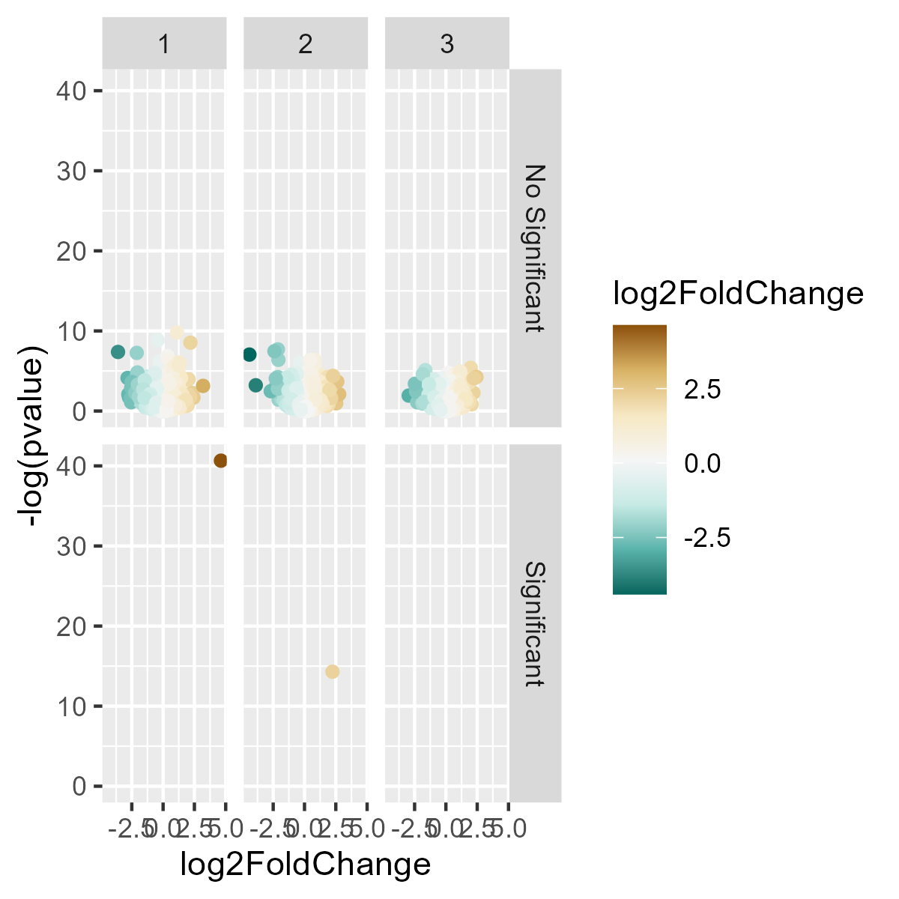</p>
